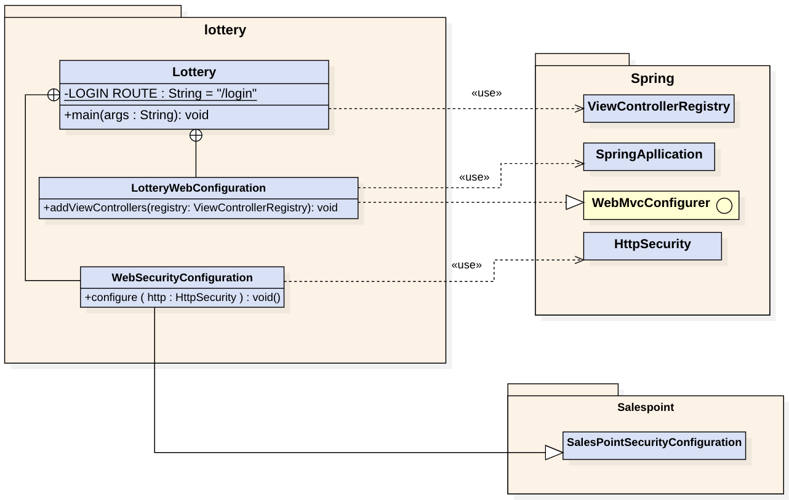
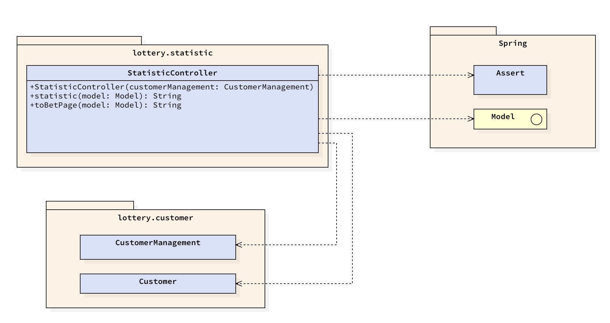

[options="header"]
[cols=""]
|===
|Version | Bearbeitungsdatum   | Autor                  |Datum        | Änderung 
|0.1	   | In Arbeit           | Mirek Král             |05.11.2021   a|
• Qualitätsziele
• Hardware-Vorgaben
• Software-Vorgaben
• erste Frameworks
• Gliederung des Dokumments
|0.2      | In Arbeit           |Song Bai, Mirek Král    |06.11.2021   a|
• Kontext
• Top_Level
• External Frameworks
• Diagramme
|0.3	   | In Arbeit           | Yu-Ju Chen             |06.11.2021   a|
• 1.1 Aufgabestellung
• 5.5 Block-view_Warenkorb
|0.4     | In Arbeit           | Yutian lei             |06.11.2021   a|
• Statistic
|0.5     | In Arbeit           | Sophie Schulze         |06.11.2021   a|
• Katalog Entwurfsklassendiagramm, Beschreibung der Klassen
|0.6     | In Arbeit           | Yu-Ju Chen             |08.11.2021   a|
• 6.4 Diagramm_Laufzeit_Order hinzufügen
|0.7     | In Arbeit           | Song Bai               |09.11.2021   a|
* updated Customer component
* added runtime view of Customer
* finished Customer description
|0.8     | In Arbeit           | Yu-Ju Chen             |10.11.2021   a|
• 5.6 Rückverfolgbarkeit_order
• Kontext 4.3.2

|===

= Entwicklerdokumentation

== 1. Einführung und Ziele
=== 1.1 Aufgabenstellung
In unserem kleinen Nachbarland Gamblien ist die staatlich betriebene Lotterie Mach Dein Glück!! sehr populär. 
In Staatsbesitz befindet sich auch das weitverbreitete Netz an Annahmestellen. 
Gambliens Wirtschaftsminister Lottermann plant den Einstieg in die "virtuelle Lotterie", um auch Ausländer als Kunden zu gewinnen. 
Vorbereitend sollen der aktuelle Betrieb der Lotterie und der Annahmestellen auf Computer umgestellt und auf dieser Basis neue Dienste erprobt werden. 
Aktuell gibt es bei Mach Dein Glück!! eine Zahlenlotterie mit wöchentlicher Ziehung und ein Fußballtoto.
Wir brauchen eine Software, die alle Kernaspekte unsere aktuellen Lotterie Betrieb unterstützt und Prozesse wo immer möglich automatisieren kann.

Unsere Website (Lotterie) kann eine beliebige Anzahl von Benutzern (Benutzer) haben, die mit ihr unterschiedlich interagieren können. 
Jeder Besucher unseres Shops kann auf den Katalog (Katalog) und seine gesamte Funktionalität zugreifen. 
Der Katalog enthält die von uns angebotenen Artikel und unterscheidet zwischen Zahllotterie (Tippschein) und Fussballtoto (Football).

Neben normalen Benutzern in unserem System (Kunde) möchten wir auch administrativen Zugriff (Admin), um unser Lotteriegeschäft zu verwalten. 
Wann immer ein Kunde etwas aus unserem Katalog wetten möchte, kann er es in beliebiger Anzahl in seinen virtuellen Warenkorb legen (addItem). 
Das Gegenteil ist natürlich auch erwünscht, damit unsere Kunden ihre Meinung ändern können (stronineren). 
Während des gesamten Vorgangs kann der Kunde selbstverständlich seine Auswahl einsehen und den Gesamtpreis davon (gesamtPreis) sehen.

Nachdem Sie sich entschieden haben, auf etwas zu wetten, wird eine Bestellung (Bestellung) mit der aktuellen Uhrzeit (Datum) erstellt. 
Es enthält jeden der ausgewählten Artikel (ItemID) mit Anzahl (Anzahl) und Preis (Preis). 
Sollte der gewählte Artikel in dieser Zeit nicht verfügbar sein (aenderung5MinutenVorBeginn), sollte dem Kunden ein Fehler angezeigt werden. 
Nachdem das Spiel beendet ist, zeigt das System den Kunden seinen Status an (BestellungStatus),weder gewinnen, verlieren oder unentschlossen(verloren/gewonnen/unentschieden).

Unsere Website soll einem Besucher selbstverständlich die Möglichkeit bieten, sich zu registrieren (registrieren). 
Da wir möchten, dass nur registrierte Benutzer Zugriff auf einige Funktionen haben, ist ein Sicherheitssystem erforderlich. 
Wir vertrauen dem State-of-the-Art-Authentifizierungsmechanismus mit Benutzername (Benutzername) und einem Passwort (Passwort).

Alles in allem wollen wir ein schönes, schnelles und sicheres System, mit dem wir alle unsere Kunden und die Statistik verwalten können. 
Es soll unseren Bestellprozess unterstützen und es uns ermöglichen, alles, was damit zusammenhängt, zu verwalten. Die Benutzererfahrung sollte mit unserer schönen Benutzeroberfläche fantastisch sein.

=== 1.2 Qualitätsziele

==== Wartbarkeit
Dieses Merkmal stellt den Maß an Effektivität und Effizienz dar, mit dem ein Produkt oder System modifiziert werden kann, um es zu verbessern, zu korrigieren oder an veränderte Umgebungsbedingungen und Anforderungen anzupassen.

==== Wartbarkeit
Maß, in dem ein Produkt oder System von bestimmten Benutzern verwendet werden kann, um bestimmte Ziele mit Effektivität, Effizienz und Zufriedenheit in einem bestimmten Nutzungskontext zu erreichen.

==== Sicherheit
Maß, in dem ein Produkt oder System Informationen und Daten schützt, damit Personen oder andere Produkte oder Systeme den Grad des Datenzugriffs haben, der ihrer Art und Berechtigungsstufe entspricht.

1 = Nicht wichtig
2 = Sehr wichtig
[options="header", cols="3h, ^1, ^1, ^1, ^1, ^1"]
|===
|Qualitätsanforderung | 1 | 2 | 3 | 4 | 5
|Wartbarkeit          |   |   |   | x | 
|Anwendbarkeit        |   |   | x |   | 
|Sicherheit           |   |   | x |   | 
|===

== 2. Randbedingungen
=== 2.1 Hardware-Vorgaben
• Verbindung zum Internet (Router)
• Elektronisches Gerät, der sich mit dem Internetnetz verbinden kann (PC, Handy, Tablet / iPad, usw.)
• Zsätzlich: Tastatur, Maus

=== 2.2 Software-Vorgaben
Es wird verlangt Java der Version 11 und neuer.

Das System wird von folgenden Web-Browsers unterstütz

• Mozila Firefox v93.0+
• Google Chrome 94.0+
• Microsoft Edge 95.0+
• Safari v15.0+

=== 2.3 Vorgaben zum Betrieb des Software

Das System soll die Struktur der Lotterie digitalisieren. Die Kunden dürfen online wetten,
Tippscheine ausfüllen und sich über Spielregeln informieren ohne an eine Filiale gebunden
zu sein. Nebenbei soll das System die Welt der Lotterie auch internationalen Kunden eröffnen.
Ein großer Vorteil besteht darin, dass die Online-Lotterie ganzjährig, rund um die Uhr geöffnet ist.

Die häufigsten Nutzer der Lotterie sind Erwachsene (ab 18 J.), die am Glücksspiel interessiert sind.
Des Weiteren muss ein Benutzer mit der Nutzung eines Internetbrowsers sowie des Umgangs einer Webseite vertraut sein.

== 3. Kontextabgrenzung
=== 3.1 Kontextdiagramm

[[context_diagram]]

== 4. Lösungsstrategie
=== 4.1 Erfüllung der Qualitätsziele
[options="header"]
|=== 
|Qualitätsziel |Lösungsansatz
|Wartbarkeit 
a|
* Wiederverwendbarkeit:
** die Komponenten des Systems sollen so entwickelt werden, dass sie von anderen Objekten benutzt werden können
    -> durch OOP
* Erweiterbarkeit:
** Objekte des Systems sollen fehlerfrei erweiterbar sein oder auch verbessert, ohne Konflikte mit anderen Komponenten auszulösen

|Anwendbarkeit
a|
* einfache Bedienung: 
** ein Nutzer soll keine großen Schwierigkeiten haben, die Funktionalitäten der Webseite zu nutzen -> z.B. Beschreibung wie man Lottoschein ausfüllt
* Fehlerhate Eingaben:
** Hinweise auch richtige Eingabe, abweisen von ungültigen Eingaben

|Security
a|
* Authentifizierung von Nutzern
* volle Funktionalität der Website nur für registrierte/eingeloggte Nutzer zugänglich
|===

=== 4.2 Softwarearchitektur
* Beschreibung der Architektur anhand der Top-Level-Architektur oder eines Client-Server-Diagramms

[[context_diagram]]

[[context_diagram]]
image:diagramm/soft_arch.png[context diagram]

=== 4.3 Entwurfsentscheidungen
==== 4.3.1. Verwendete Muster
• Spring MVC

==== 4.3.2. Persistenz
Die Anwendung verwendet Hibernate-Annotationsbasiertes Mapping, um Java-Klassen Datenbanktabellen zuzuordnen. Als Datenbank wird H2 verwendet. Die Persistenz ist standardmäßig deaktiviert. Um den Persistenzspeicher zu aktivieren, müssen die folgenden beiden Zeilen in der Datei application.properties unkommentiert werden:

# spring.datasource.url=jdbc:h2:./db/lottery
# spring.jpa.hibernate.ddl-auto=update

==== 4.3.3. Benutzeroberfläche

[[context_diagram]]
image:diagramm/ui.png[context diagram]

==== 4.3.4. Verwendung externer Frameworks

[options="header", cols="1,2"]
|===
|Externes Package |Verwendet von (Klasse der eigenen Anwendung)
|salespointframework.catalog_ltr                         a|
• catalog_ltr.Foot
• catalog_ltr.Num
|salespointframework.boot                             |lottery.lottery
|salespointframework.useraccount                     a|
• customer.customer
• customer.CustomerDataInitializer
• customer.CustomerManagement
• order.OrderController
|springframework.security                              |lottery.WebSecurityConfiguration
|springframework.web                                   |lottery.web
|salespointframework.core                             a|
• catalog_ltr.CatalogInitializer
• customer.CustomerDatainitializer
|salespointframework.SalespointSecurityConfiguration   |lottery.WebSecurityConfiguration
|salespointframework.time                              |catalog_ltr.CatalogController
|springframework.data                                 a|catalog_ltr.LotteryCatalog
|springframework.security                              |videoshop.WebSecurityConfiguration
|salespointframework.time                              |catalog.CatalogController
|springframework.data                                 a|catalog.LotteryCatalog
|springframework.security                              |lottery.WebSecurityConfiguration
|springframework.ui                                   a|
• catalog_ltr.CatalogController
• customer.CustomerController
• order.OrderController               
|springframework.util                                 a|
• customer.CustomerDataInitializer
• customer.CustomerController
|springframework.validation                            |customer.CustomerController
|springframework.web                                   |lottery.LotteryWebConfiguration
|===

== 5. Bausteinsicht / Entwurfsklassendiagramme der einzelnen Packages

=== 5.1 Lotterie

[[context_diagram]]

[options="header"]
|=== 
|Klasse/Enumeration |Description
|Lottery                    |Die essentielle Klasse des ganzen Programms. Sie sorgt dafür, dass mit Hilfe von SpringApplication Klasse alles ordnungsgemäß beim Einschalten konfiguriert wird und abschließend startet die ganze Applikation.
|WebSecurityConfiguration   |Sie dient zur unmittelbaren Weiterleiten von /login direkt an das template login.htm.
|VideoShopWebConfiguration  |Konfigurationsklasse zum Einrichten grundlegender Sicherheits- und Anmelde-/Abmeldeoptionen.
|===

=== 5.2 Katalog

[[catalog]]

[options="header"]
|=== 
|Klasse/Enumeration |Description
|Item
|ist ein Produkt im Lotteriekatalog, ein Item ist ein Tippschein oder ein Fußballspiel

|Tippschein
|ist ein Produkt für die Zahlenlotterie, auf einen Tippschein können beliebig viele Zahlenwetten abgegeben werden

|Football
|repräsentiert ein Fußballspiel mit folgenden Merkmalen:

* Heimmannschaft
* Gastmannschaft
* Preis
* Liga
* Datum bzw. Spieltag

Auf ein Fußballspiel können beliebig viele Wetten abgegeben werden.

|Wette
|ist eine Zahlenwette oder eine Fußballwette; eine Wette einen Status, der initial OFFEN ist

|Zahlenwette
|ist eine Wette, die auf einen Tippschein abgegeben wird; der Tipp dieser Wette besteht aus einer Liste von 6 Zahlen

|Fußballwette
|wird auf einen Fußballspiel abgegeben; der Unterschied zur Zahlenwette liegt darin, dass der Tipp der Fußballwette ein String ist, z.B. "Heim gewinnt", "Gast gewinnt", "Unentschieden"

|Status
|beschreibt den Status einer Wette:

* OFFEN: Wette noch nicht ausgewertet
* GEWONNEN: Nutzer hat richtig getippt
* VERLOREN: Nutzer hat falsch getippt

|KatalogController
|zeigt Items je nach Typ in einem Katalog  der Zahlenlotterie oder der Fußballlotterie an, bearbeitet Anfragen

|KatalogInitializer
|er implementiert DataInitializer, erstellt Produkte für den Katalog

|Lotteriekatalog
|ist eine Erweiterung von Salespoint.Catalog, die spezifische Anforderungen für die Lotterie enthält
|===

=== 5.3. Kunde
[[customer]]
image::./models/design/block_customer.png[Location, 100%, 100%, pdfwidth=100%, title= "customer package", align=center]

[options="header"]
|=== 
|Klasse/Enumeration |Description
|Customer|Eine Klasse, erbt Salespoint-Useraccount mit Guthaben. Beschreibt einen Kunden.
|CustomerController|Ein Spring MVC Controller, der kümmert sich um Registierung, Gruppeerstellung, Kontoaufladen, Kundeansicht usw.
|CustomerDataInitializer|Eine Implementierung für DataInitializer, sodass die Applikation dummi Kunden haben können wenn die startet.
|CustomerManagement|Verwaltet Kunden und Gruppen
|CustomerRepository|Ein Interface, verwaltet Kunden-Instanz und speichert Kunden.
|Group|Eine Klasse, erbt Salespoint-Useraccount und beschreibt die Gruppe.
|GroupRepository|Ein Interface, verwaltet Gruppe-Instanz und speichert Gruppen.
|RegistrationFrom|Ein Interface, kümmert sich um Validierung der Eingaben von Kunden über Registierung.
|===

=== 5.4 Statistik 

[[context]]

[options="header"]
|=== 
|Klasse/Enumeration |Description
|StatisticController|A Spring MVC Controller to handle requests to show Income and loss
|===

=== 5.5 Order

[[Order]]
image:models/design/block_order.png[Location, 100%, 100%, pdfwidth=100%, title= "Order", align=center] 

[options="header"]
|=== 
|Class/Enumeration |Description
|BestellungController |Ein Spring MVC Controller zur Handhabung des Warenkorbs
|===

=== 5.6 Rückverfolgbarkeit zwischen Analyse- und Entwurfsmodell
_Die folgende Tabelle zeigt die Rückverfolgbarkeit zwischen Entwurfs- und Analysemodell. Falls eine Klasse aus einem externen Framework im Entwurfsmodell eine Klasse des Analysemodells ersetzt,
wird die Art der Verwendung dieser externen Klasse in der Spalte *Art der Verwendung* mithilfe der folgenden Begriffe definiert:_

* Inheritance/Interface-Implementation
* Class Attribute
* Method Parameter

[options="header"]
|===
|Class/Enumeration (Analysis Model) |Class/Enumeration (Design Model) |Usage

|Order                  |Salespoint.Order | Method Parameter
|OrderLine              |Salespoint.Orderline (via Salespoint.Order) | Method Parameter (via Salespoint.Order)
|OrderManager           |Salespoint.OrderManager<Order> a|
						* Class Attribute
						* Method Parameter
|OrderStatus            |Salespoint.OrderStatus | Method Parameter

|===

== 6. Laufzeitsicht
* Darstellung der Komponenteninteraktion anhand eines Sequenzdiagramms, welches die relevantesten Interaktionen darstellt.

=== Customer
[[customer_runtime]]

=== Order
[[runtime_Order]]
image:models/design/runtime_order.png[Location, 100%, 100%, pdfwidth=100%, title= "Order", align=center]

== 7. Technische Schulden
* Auflistung der nicht erreichten Quality Gates und der zugehörigen SonarQube Issues zum Zeitpunkt der Abgabe

=== 7.1 Quality Gates
[options="header"]
|===
|Quality Gate                  |Tatsächlicher Wert        |Ziel
|Zuverlässigkeit               |...                       |A
|Abdeckung                     |..                        |50%
|===

=== 7.2 Probleme
[options="header"]
|===
|..                    |..                        |..
|===
