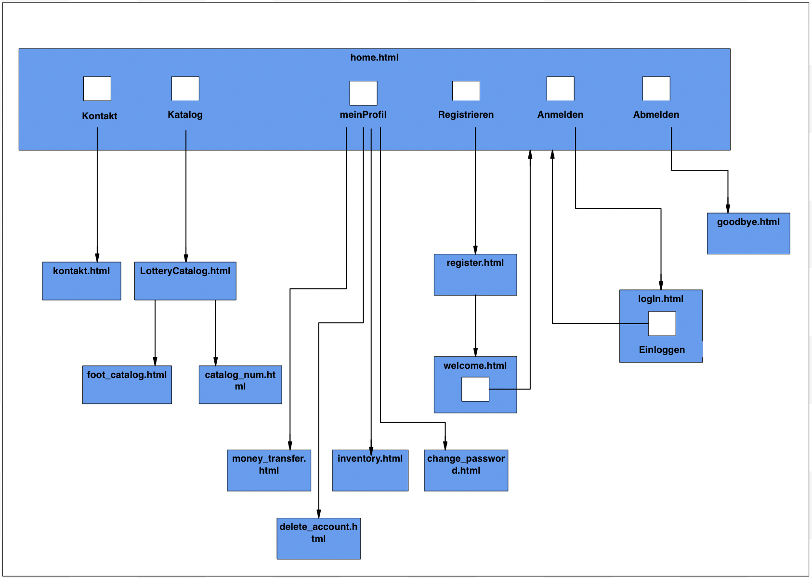

[options="header"]
[cols=""]
|===
|Version | Bearbeitungsdatum   | Autor                  |Datum        | Änderung 
|0.1	   | In Arbeit           | Mirek Král             |05.11.2021   a|
• Qualitätsziele
• Hardware-Vorgaben
• Software-Vorgaben
• erste Frameworks
• Gliederung des Dokumments
|0.2      | In Arbeit           |Song Bai, Mirek Král    |06.11.2021   a|
• Kontext
• Top_Level
• External Frameworks
• Diagramme
|0.3	   | In Arbeit           | Yu-Ju Chen             |06.11.2021   a|
• 1.1 Aufgabestellung
• 5.5 Block-view_Warenkorb
|0.4     | In Arbeit           | Yutian lei             |06.11.2021   a|
• Statistic
|===

= Entwicklerdokumentation

== 1. Einführung und Ziele
=== 1.1 Aufgabenstellung
In unserem kleinen Nachbarland Gamblien ist die staatlich betriebene Lotterie Mach Dein Glück!! sehr populär. 
In Staatsbesitz befindet sich auch das weitverbreitete Netz an Annahmestellen. 
Gambliens Wirtschaftsminister Lottermann plant den Einstieg in die "virtuelle Lotterie", um auch Ausländer als Kunden zu gewinnen. 
Vorbereitend sollen der aktuelle Betrieb der Lotterie und der Annahmestellen auf Computer umgestellt und auf dieser Basis neue Dienste erprobt werden. 
Aktuell gibt es bei Mach Dein Glück!! eine Zahlenlotterie mit wöchentlicher Ziehung und ein Fußballtoto.
Wir brauchen eine Software, die alle Kernaspekte unsere aktuellen Lotterie Betrieb unterstützt und Prozesse wo immer möglich automatisieren kann.

Unsere Website (Lotterie) kann eine beliebige Anzahl von Benutzern (Benutzer) haben, die mit ihr unterschiedlich interagieren können. 
Jeder Besucher unseres Shops kann auf den Katalog (Katalog) und seine gesamte Funktionalität zugreifen. 
Der Katalog enthält die von uns angebotenen Artikel und unterscheidet zwischen Zahllotterie (Tippschein) und Fussballtoto (Football).

Neben normalen Benutzern in unserem System (Kunde) möchten wir auch administrativen Zugriff (Admin), um unser Lotteriegeschäft zu verwalten. 
Wann immer ein Kunde etwas aus unserem Katalog wetten möchte, kann er es in beliebiger Anzahl in seinen virtuellen Warenkorb legen (addItem). 
Das Gegenteil ist natürlich auch erwünscht, damit unsere Kunden ihre Meinung ändern können (stronineren). 
Während des gesamten Vorgangs kann der Kunde selbstverständlich seine Auswahl einsehen und den Gesamtpreis davon (gesamtPreis) sehen.

Nachdem Sie sich entschieden haben, auf etwas zu wetten, wird eine Bestellung (Bestellung) mit der aktuellen Uhrzeit (Datum) erstellt. 
Es enthält jeden der ausgewählten Artikel (ItemID) mit Anzahl (Anzahl) und Preis (Preis). 
Sollte der gewählte Artikel in dieser Zeit nicht verfügbar sein (aenderung5MinutenVorBeginn), sollte dem Kunden ein Fehler angezeigt werden. 
Nachdem das Spiel beendet ist, zeigt das System den Kunden seinen Status an (BestellungStatus),weder gewinnen, verlieren oder unentschlossen(verloren/gewonnen/unentschieden).

Unsere Website soll einem Besucher selbstverständlich die Möglichkeit bieten, sich zu registrieren (registrieren). 
Da wir möchten, dass nur registrierte Benutzer Zugriff auf einige Funktionen haben, ist ein Sicherheitssystem erforderlich. 
Wir vertrauen dem State-of-the-Art-Authentifizierungsmechanismus mit Benutzername (Benutzername) und einem Passwort (Passwort).

Alles in allem wollen wir ein schönes, schnelles und sicheres System, mit dem wir alle unsere Kunden und die Statistik verwalten können. 
Es soll unseren Bestellprozess unterstützen und es uns ermöglichen, alles, was damit zusammenhängt, zu verwalten. Die Benutzererfahrung sollte mit unserer schönen Benutzeroberfläche fantastisch sein.

=== 1.2 Qualitätsziele

==== Wartbarkeit
Dieses Merkmal stellt den Maß an Effektivität und Effizienz dar, mit dem ein Produkt oder System modifiziert werden kann, um es zu verbessern, zu korrigieren oder an veränderte Umgebungsbedingungen und Anforderungen anzupassen.

==== Wartbarkeit
Maß, in dem ein Produkt oder System von bestimmten Benutzern verwendet werden kann, um bestimmte Ziele mit Effektivität, Effizienz und Zufriedenheit in einem bestimmten Nutzungskontext zu erreichen.

==== Sicherheit
Maß, in dem ein Produkt oder System Informationen und Daten schützt, damit Personen oder andere Produkte oder Systeme den Grad des Datenzugriffs haben, der ihrer Art und Berechtigungsstufe entspricht.

1 = Nicht wichtig
2 = Sehr wichtig
[options="header", cols="3h, ^1, ^1, ^1, ^1, ^1"]
|===
|Qualitätsanforderung | 1 | 2 | 3 | 4 | 5
|Wartbarkeit          |   |   |   | x | 
|Anwendbarkeit        |   |   | x |   | 
|Sicherheit           |   |   | x |   | 
|===

== 2. Randbedingungen
=== 2.1 Hardware-Vorgaben
• Verbindung zum Internet (Router)
• Elektronisches Gerät, der sich mit dem Internetnetz verbinden kann (PC, Handy, Tablet / iPad, usw.)
• Zsätzlich: Tastatur, Maus

=== 2.2 Software-Vorgaben
Es wird verlangt Java der Version 11 und neuer.

Das System wird von folgenden Web-Browsers unterstütz

• Mozila Firefox v93.0+
• Google Chrome 94.0+
• Microsoft Edge 95.0+
• Safari v15.0+

=== 2.3 Vorgaben zum Betrieb des Software

== 3. Kontextabgrenzung
=== 3.1 Kontextdiagramm

[[context_diagram]]
image:diagramm/kontext_devel.png[context diagram]

== 4. Lösungsstrategie
=== 4.1 Erfüllung der Qualitätsziele
[options="header"]
|=== 
|Qualitätsziel |Lösungsansatz
|... |...
|===

=== 4.2 Softwarearchitektur
* Beschreibung der Architektur anhand der Top-Level-Architektur oder eines Client-Server-Diagramms

[[context_diagram]]
image:diagramm/top_level_devel.png[context diagram]

[[context_diagram]]

=== 4.3 Entwurfsentscheidungen
==== 4.3.1. Verwendete Muster
==== 4.3.2. Persistenz
==== 4.3.3. Benutzeroberfläche

[[context_diagram]]

==== 4.3.4. Verwendung externer Frameworks

[options="header", cols="1,2"]
|===
|Externes Package |Verwendet von (Klasse der eigenen Anwendung)
|salespointframework.catalog                         a|
• catalog.Foot
• catalog.Num
|salespointframework.boot                             |lottery.Lottery
|salespointframework.useraccount                     a|
• customer.Customer
• customer.CustomerDataInitializer
• customer.CustomerManagement
• order.OrderController
|springframework.security                              |lottery.WebSecurityConfiguration
|springframework.web                                   |lottery.web
|salespointframework.core                             a|
• catalog.CatalogInitializer
• customer.CustomerDatainitializer
|salespointframework.SalespointSecurityConfiguration   |lottery.WebSecurityConfiguration
|salespointframework.time                              |catalog.CatalogController
|springframework.data                                 a|catalog.LotteryCatalog
|springframework.security                              |videoshop.WebSecurityConfiguration
|springframework.ui                                   a|
• catalog.CatalogController
• customer.CustomerController
• order.OrderController               
|springframework.util                                 a|
• customer.CustomerDataInitializer
• customer.CustomerController
|springframework.validation                            |customer.CustomerController
|springframework.web                                   |videoshop.VideoShopWebConfiguration
|===

== 5. Bausteinsicht / Entwurfsklassendiagramme der einzelnen Packages

=== 5.1 Lotterie

[[context_diagram]]
image:diagramm/lottery.png[context diagram]

[options="header"]
|=== 
|Klasse/Enumeration |Description
|...|...
|===

=== 5.2 Katalog
[options="header"]
|=== 
|Klasse/Enumeration |Description
|...|...
|===

=== 5.3. Kunde
[[customer]]
image::./models/design/block_customer.png[Location, 100%, 100%, pdfwidth=100%, title= "customer package", align=center]

[options="header"]
|=== 
|Klasse/Enumeration |Description
|Customer|Eine Klasse, erbt Salespoint-Useraccount mit Guthaben. Beschreibt einen Kunden.
|CustomerController|Ein Spring MVC Controller, der kümmert sich um Registierung, Gruppeerstellung, Kontoaufladen, Kundeansicht usw.
|CustomerDataInitializer|Eine Implementierung für DataInitializer, sodass die Applikation dummi Kunden haben können wenn die startet.
|CustomerManagement|Verwaltet Kunden und Gruppen
|CustomerRepository|Ein Interface, verwaltet Kunden-Instanz und speichert Kunden.
|Group|Eine Klasse, erbt Salespoint-Useraccount und beschreibt die Gruppe.
|GroupRepository|Ein Interface, verwaltet Gruppe-Instanz und speichert Gruppen.
|RegistrationFrom|Ein Interface, kümmert sich um Validierung der Eingaben von Kunden über Registierung.
|===

=== 5.4 Statistik 

[[context]]
image:diagramm/Statistic.png[context diagram]

[options="header"]
|=== 
|Klasse/Enumeration |Description
|StatisticController|A Spring MVC Controller to handle requests to show Income and loss
|===

=== 5.5 Warenkorb

[[Warenkorb]]
image:models/design/block_Warenkorb.png[Location, 100%, 100%, pdfwidth=100%, title= "Warenkorb", align=center] 

[options="header"]
|=== 
|Class/Enumeration |Description
|BestellungController |Ein Spring MVC Controller zur Handhabung des Warenkorbs
|===

=== 5.6 Rückverfolgbarkeit zwischen Analyse- und Entwurfsmodell
_Die folgende Tabelle zeigt die Rückverfolgbarkeit zwischen Entwurfs- und Analysemodell. Falls eine Klasse aus einem externen Framework im Entwurfsmodell eine Klasse des Analysemodells ersetzt,
wird die Art der Verwendung dieser externen Klasse in der Spalte *Art der Verwendung* mithilfe der folgenden Begriffe definiert:_

* Inheritance/Interface-Implementation
* Class Attribute
* Method Parameter

[options="header"]
|===
|Klasse/Enumeration (Analysemodell) |Klasse/Enumeration (Entwurfsmodell) |Art der Verwendung
|...|...|...
|===

== 6. Laufzeitsicht
* Darstellung der Komponenteninteraktion anhand eines Sequenzdiagramms, welches die relevantesten Interaktionen darstellt.

== 7. Technische Schulden
* Auflistung der nicht erreichten Quality Gates und der zugehörigen SonarQube Issues zum Zeitpunkt der Abgabe

