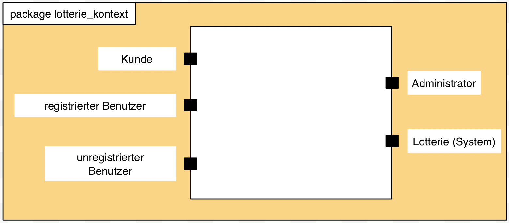
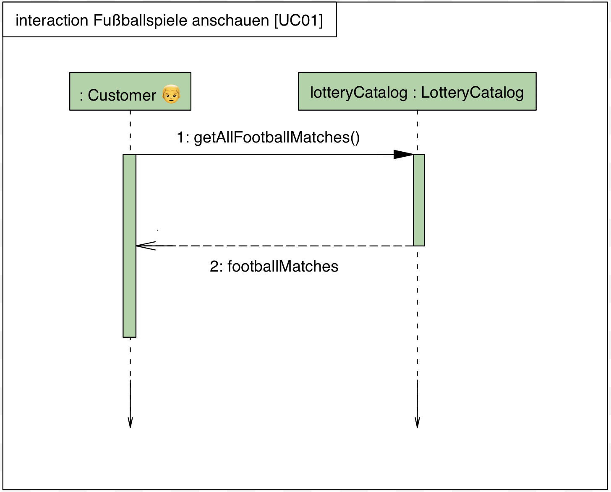
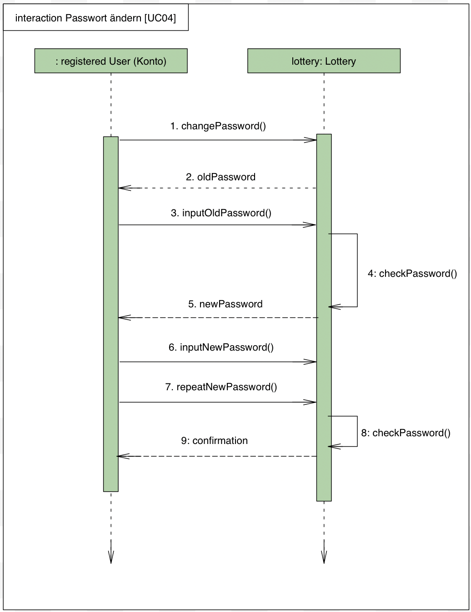
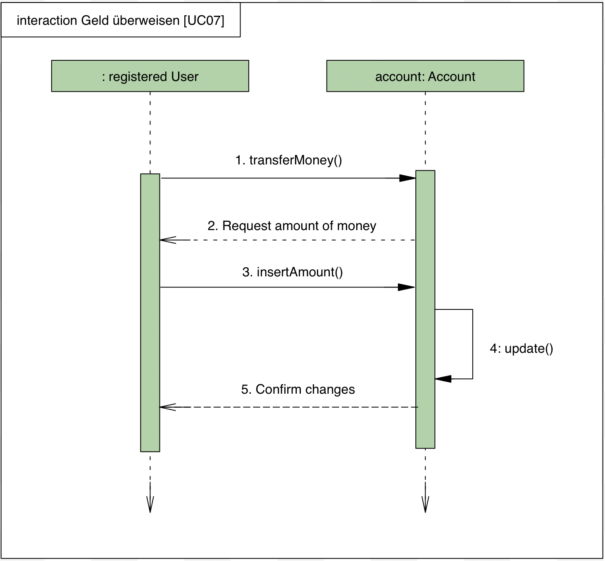
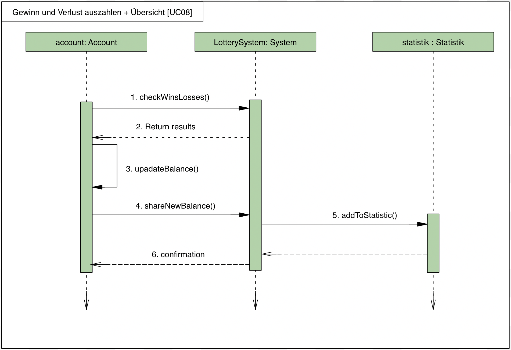
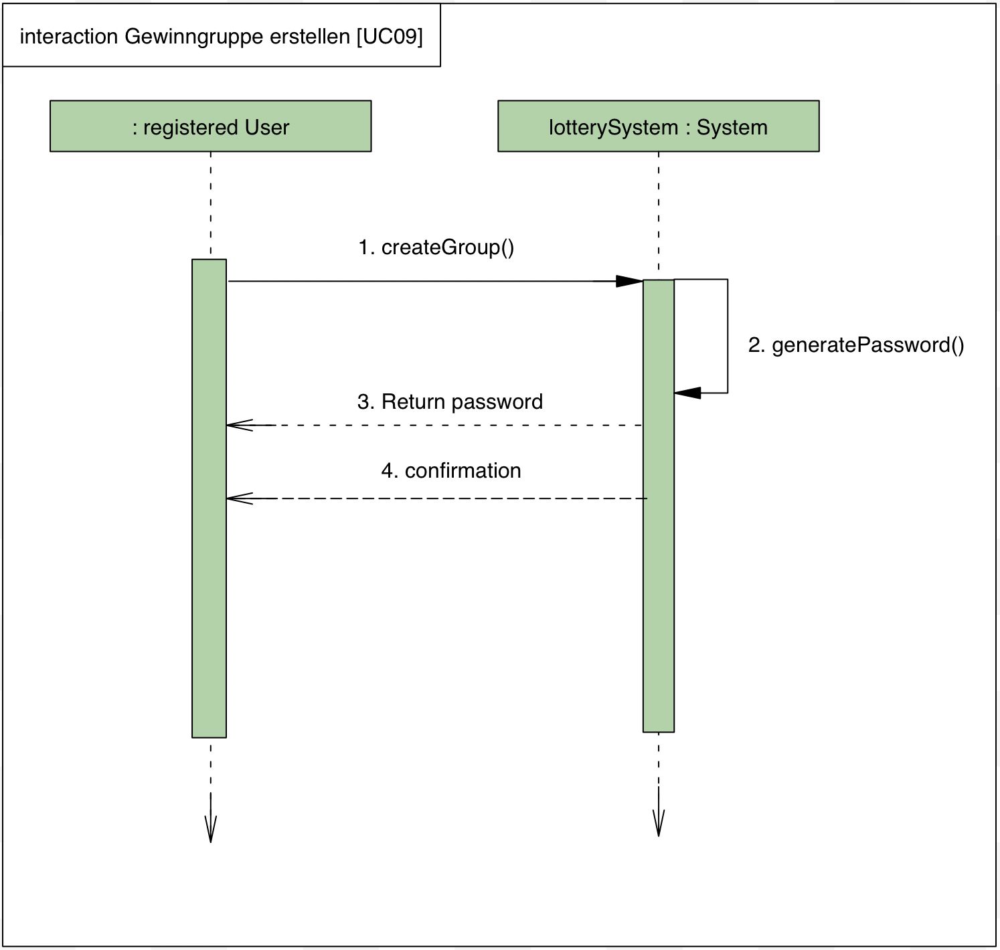
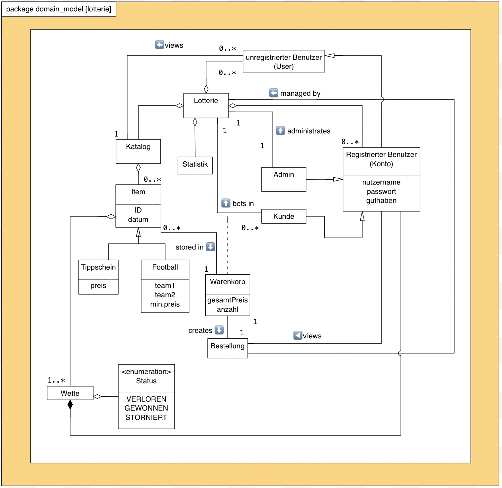

= Pflichtenheft
:project_name: Projektname
== __{project_name}__

[options="header"]
[cols="1, 1, 1, 1, 4"]
|===
|Version | Status      | Bearbeitungsdatum   | Autoren(en) |  Vermerk
|0.1     | In Arbeit   | 10.10.2021          | Autor       | Initiale Version
|0.2     | In Arbeit   | 22.10.2021          | Mirek Král  | Ergänzung des Pflichtenhesftes
|0.3     | In Arbeit   | 22.10.2021          | Sophie Schulze  | Ergänzung: Beschreibung der Use Cases
|0.4     | In Arbeit   | 22.10.2021          | Song Bai    | Ergänzung der Beschreibung
|0.5     | In Arbeit   | 25.10.2021          | Alle Gruppenmitglieder | Ergänzung des Pflichtenhesftes
|0.6     | In Arbeit   | 26.10.2021          | Yu-Ju Chen | Ergänzung: Use Cases-Beschreibung
|0.7     | In Arbeit   | 26.10.2021          | Sophie Schulze a| Zusammenfassung, Beschreibung UC02, Korrektur Rechtschreibung, Beginn Klassen und Enumerationen
|0.8     | In Arbeit   | 27.10.2021          | Sophie Schulze | Use Cases 13,14,15
|0.9     | In Arbeit   | 27.10.2021          | Yutian Lei   | Use Cases 10, 11
|1.0     | In Arbeit   | 27.10.2021          | Yu-Ju Chen | Ergänzung: Use Cases-Beschreibung
|1.1    | In Arbeit   | 27.10.2021          | Mirek Král, Song Bai |Bilder hochladen und UC Ergänzung
|1.2    | In Arbeit   | 28.10.2021          | Sophie Schulze a| Muss- und Kann Kriterien, Akzeptanztestfälle hinzugefügt
|1.3     | In Arbeit   | 29.10.2021          | Yu-Ju Chen | Use Cases-Beschreibung: Functionale Anforderung ginzugefügt und link geaddt
|1.4    | In Arbeit   | 29.10.2021          | Mirek Král, Song Bai |Bilder hochladen, Klassendiagramm aktualisieren und GUI Ergänzung
|1.5   |bereit für 1. Meilenstein |29.10.2021|Sophie Schulze         |Klassen/Enumerationen ergänzt, Anpassung von Text an GUI
|===

== 1. Inhaltsverzeichnis
Dieses Dokument benötigt ein Inhaltsverzeichnis. Es existieren mehrere Einbindungsmöglichkeiten.
_Inhalt_
 
  1. Inhaltsverzeichnis
  2. Zusammenfassung
  3. Aufgabenstellung
  4. Produktnutzung
  5. Interessensgruppen (Stakeholders)
  6. Systemgrenze und Top-Level-Architektur
  
  6.1. Kontextdiagramm
  6.2. Top-Level-Architektur
  
  7. Use-Case
  
  7.1  Akteure
  7.2  Überblick Use-Case-Diagramm
  7.3  Use-Case-Beschreibungen
  
  8. Funktionale Anforderungen
  
  8.1  Muss-Kriterien
  8.2  Kann-Kriterien
  
  9. Nicht-Funktionale Anforderungen
  
  9.1  Qualitätsziele
  9.2  Konkrete Nicht-Funktionale Anforderungen
  
  10. GUI Prototyp
  11. Datenmodell
  
  11.1  Überblick: Klassendiagramm
  11.2  Klassen und Enumerationen
  
  12. Akzeptanztestfälle
  13. Glossar
  14. Offene Punkte

== 2. Zusammenfassung
Eine kurze Beschreibung des Dokuments. Wenige Absätze.

Im Folgenden befindet sich das Pflichtenheft zur Aufgabe Lotterie der Gruppe swt21w09. Das Heft beinhaltet die fundamentalste Eingeschaften des angestrebten Systems und bildet somit die Grundlage des Projekts. Weiterhin wird in diesem Dokument spezifiziert welche Anforderungen, die Software am Ende des Entwicklungsprozesses zu erüllen hat.

Außerdem ist das Pflichtenheft als Vertrag zwischen dem Kunden und dem Entwicklerteam anzusehen und es stellt vor wie das Problem bzw. der Auftrag des Kunden gelöst werden soll.

== 3. Aufgabenstellung und Zielsetzung
Text aus Aufgabenstellung kopieren und ggfs. präzisieren.
Insbesondere ergänzen, welche Ziele mit dem Abschluss des Projektes erreicht werden sollen.

Lotterie 

In unserem kleinen Nachbarland Gamblien ist die staatlich betriebene Lotterie Mach Dein Glück!! sehr populär. In Staatsbesitz befindet sich auch das weitverbreitete Netz an Annahmestellen.
Gambliens Wirtschaftsminister Lottermann plant den Einstieg in die "virtuelle Lotterie", um auch Ausländer als Kunden zu gewinnen. Vorbereitend sollen der aktuelle Betrieb der Lotterie und der Annahmestellen auf Computer umgestellt und auf dieser Basis neue Dienste erprobt werden.
Aktuell gibt es bei Mach Dein Glück!! eine Zahlenlotterie mit wöchentlicher Ziehung und ein Fußballtoto.
Die Lotterie Mach Dein Glück!! ist eine ganz konventionelle Lotterie "6 aus 49 mit Zusatzzahl". Tippscheine werden an den Annahmestellen bis zum Samstag eingereicht; am Sonntag erfolgt unter strenger notarieller Aufsicht die Ziehung.
Das Fußballtoto bezieht sich mangels eigener Liga auf die oberen beiden Klassen der deutschen Bundesliga. Tippscheine können bis 24 Stunden vor Beginn des Spieltags (evtl. auf mehrere Spieltage verteilt und erst mit dem letzten Nachholspiel beendet) in Bundesliga bzw. Pokalrunden eingereicht werden.
Bei der Zahlenlotterie können derzeit neben Einzeltippscheinen auch Dauertippscheine (monatlich, halb- bzw. ganzjährig) erworben werden. Tippscheine für das Fußballtoto können ab Veröffentlichung der Spielkalender beliebig im Voraus ausgefüllt und abgegeben werden. Nach Minister Lottermanns Plänen soll das Angebot künftig gemäß den neuen Medien flexibler gestaltet sein:

• Es werden Gewinngemeinschaften unterstützt. Beim Einrichten einer Gewinngemeinschaft wird von der Lotterie ein Gemeinschafts-Passwort vergeben. Wer das Gemeinschafts-Passwort kennt, darf für die Gemeinschaft einen Tipp abgeben und darf seinerseits an Personen Mitglieder-Passwörter vergeben. Mit dem Mitglieder-Passwort kann die Person ihre Anteile (ganzzahlige Vielfache des Grundeinsatzes) bis jeweils vor Wettschluss (gegen Bar- bzw. Vorauszahlung) erhöhen oder verringern bzw. zeitweilig ganz aussetzen.

• Änderungen am Tipp bzw. Einsatz sind bis jeweils 5 Minuten vor Beginn einer Auslosung bzw. eines Fußballspieltags möglich.

• An die Stelle von Bareinzahlung sollen künftig Abbuchungen von Konten bei der Lotteriebank treten, die jeder Kunde dort einrichtet und auf die er bar oder per Überweisung rechtzeitig seine Einsätze überträgt. Von diesem Konto werden (in der Reihenfolge der Auslosungen) Einsätze abgebucht. Bei nicht ausreichender Deckung erhält der Kunde eine entsprechende Mitteilung und nimmt an dieser Verlosung nicht teil. Je Mitteilung wird eine Gebühr von 2 € erhoben; nach zehn Mitteilungen wird der Kunde vorläufig aus seinen Gewinngemeinschaften entfernt.

• Administratoren der Lotterie sollen die Möglichkeit haben, jederzeit eine Übersicht über die abgegebenen Wetten der Kunden und die finanzielle Situation (Gewinne/Verluste) der Lotterie nach dem jeweiligen Ziehungstagen und Spieltagen zu bekommen.

• Minister Lottermann hat unter dem Aktenzeichen "MDG 2000" eine Ausschreibung veröffentlicht, und um Einreichung geeigneter, künftig ausbaubarer Prototypen für ein solches System gebeten. Ihr SalesPoint-Team hat zufällig davon erfahren und beabsichtigt, an dem Wettbewerb teilzunehmen.
Die Lotteriebetreiber wären daran interessiert, ihre Fußballtoto-Daten direkt und aktuell aus dem Internet zu beziehen. Wenn der Prototyp dies demonstrieren würde, sähe man das als ein besonderes Plus an.

== 4. Produktnutzung
In welchem Kontext soll das System später genutzt werden? Welche Rahmenbedingungen gelten?
Zusätzlich kurze Einleitung für fachfremde Personen

Das System soll die Struktur der Lotterie digitalisieren. Die Kuden dürfen online wetten, Tippscheine ausfüllen und sich über Spielregeln informieren ohne an eine Filiale gebunden zu sein. Nebenbei soll das System die Welt der Lotterie auch internationalen Kunden eröffnen. Ein großer Vorteil besteht darin, dass die Online-Lotterie 24/7 geöffnet ist.

Das System soll von folgenden Web-Browsers unterstütz werden

• Mozila Firefox v93.0+
• Google Chrome 94.0+
• Microsoft Edge 95.0+
• Safari v15.0+

== 5. Interessensgruppen (Stakeholders)
Welche realen und juristischen Personen(-gruppen) haben Einfluss auf die Anforderungen im Projekt?

Prorität:1 (niedrig) zu 5 (hoch)

[options="header", cols="5h, ^1, ^1, ^1"]
|===
|Name            | Priorität (1..5) | Beschreibung                                                                             | Ziele
|André Schmidt   | 5                | Der Auftraggeber unseres Projektes                                                      a| 
• Kundenbereich erweitern
• Digitalisierung
• Geld sparen
• Effizienz der Struktur (Einsparung bei Mitarbeiter, Material etc.)
|Kunden          | 5                | Sie stellen die grösste Interessengruppe dar und sorgen für das Einkommen der Lotterie. a| 
• Geld gweinnen
• intuitive Handhabung
• guter Kunden-Service
|Administrator   | 3                | Er behält den Überblick über den Gewinn und die Verluste der Lotterie.                  a|
• Überblick über Finanzen haben
|Entwickler      | 3                | Sie sind für die Entwicklung/Programmierung und Wartung der Website zuständig.          a| 
• leicht verstehbarer / aufgeräumter Code
• keine ,,Bananaware"
• leicht erweiterbarer Code
|===

Die Interessengruppen sind ausschließlich Erwachsene, d.h. Personen ab 18 Jahre alt.

== 6. Systemgrenze und Top-Level-Architektur

=== 6.1. Kontextdiagramm

[[context_diagram]]

=== 6.2. Top-Level-Architektur
[[TLA]]
image:diagramm/top_level.png[top-level architecture]

Top-Level-Ansicht für Lotteriesystem

== 7. Use-Cases

=== 7.1  Akteure

// See http://asciidoctor.org/docs/user-manual/#tables
[options="header"]
[cols="1,4"]
|===
|Name                         |Beschreibung
|Kunde                        |Der Kunde kann alles machen, was der registrierter Benutzer kann. Der entscheidende Unterschied ist, er kann bezahlen.
|registrierter Benutzer       |Dem registrierten Benutzer werden die eigentlichen Funktionalitäten der Internet-Lotterie eröffnet.

Ein registrierter Benutzer hat die Möglichkeit entweder am Fußballtoto oder an der Zahlenlotterie teilzunehmen. Dafür muss er sein virtuelles Portemonnaie mit Geld aufladen. Zusätzlich kann er sein Passwort ändern.
|unregistrierter Benutzer     |Der unregistrierte Benutzer ist als die Person angesehen, die beispielsweise das Web-Portal der Lotterie zum ersten Mal besucht, d.h. "Ausländer", bzw. neue potenzielle Kunden. 

Er kann sich den Katalog der Fußballspiele anschauen sowie evtl. sich über die Spielregeln der Zahlenlotterie informieren. Weiterhin kann er sich registrieren, was schließlich seine Rolle als unregistrierter Benutzer beendet.
|Administrator                |Dieser ist die meiste Zeit nur ein gewisser Zuschauer der ganzen Struktur. Er schaut sich die generierte Statistik an. Er kann im Laufe des Betriebes mit neunen Funktionalitäten kommen, die ein neues Service für die Kunden darstellen.
|Lotterie (System)            |Diese ist eine virtuelle Rolle, die für den allgemeine Betrieb der ganzen Struktur sorgt. Sie speichert alle registrierte Benutzer, generiert Passwörter für Gewinnsgemeinschaftsgruppen, gründet und erweitert die Statistik der Verluste und Gewinne. 

Bemerkung: Sie bekommt einen offiziellen Name später in der Entwicklung.
|===

=== 7.2 Überblick Use-Case-Diagramm
[[use_case_diagram]]
image::./diagramm/use_case.png[Use Case diagram, 100%, 100%, pdfwidth=100%, title= "Use case diagram of lottery system", align=center]

=== 7.3 Use-Case-Beschreibungen

In Folgenden werden die im Anwendungsfalldiagramm gezeigten Anwendungsfälle im Detail beschrieben.

[cols="1h, 3"]
[[UC01]]
|===
|ID                         |**<<UC01>>**
|Name                       |Fußballspiele anschauen          
|Beschreibung               |Der Nutzer kann den Fußballwettenkatalog aufrufen, um zu sehen auf welche Fußballspiele man wetten kann.
|Akteur                     |alle Nutzer der Website
|Auslöser                   |Klicken auf den Menüpunkt "Katalog" und dann auf "Fußballtoto"
|Vorbedingung               |keine 
|Grundlegende Schritte     a|
_Fußballspiele anschauen:_ 

  1. Nutzer klickt auf Menüpunkt Fußballkatalog.
  2. Nutzer sieht Liste mit kommenden Fußballspielen
 
|Extensions                 |-
|Funktionale Anforderungen  |<<FA04>>
|===

[[sequence_diagram_watch_football]]

[cols="1h, 3"]
[[UC02]]
|===
|ID                         |**<<UC02>>**
|Name                       |Lottoschein ausfüllen          
|Beschreibung               |Ein registrierter Nutzer füllt einen Lottoschein aus, indem er 6 aus 49 Zahlen auswählt. 
|Akteur                     |registrierter Benutzer
|Auslöser                   |-
|Vorbedingung               |Der Benutzer muss sich registrieren und eingeloggt sein, um Lotoscheine ausfüllen zu können. 
|Grundlegende Schritte     a|
• Einloggen unter Gruppe oder einzeln
• Katalog anschauen
• 6 Zahlen aus 49 Zahlen wählen
|Extensions                 |-
|Funktionale Anforderungen  |<<FA02>>, <<FA09>>
|===

[cols="1h, 3"]
[[UC03]]
|===
|ID                         |**<<UC03>>**
|Name                       |Fußballwetten        
|Beschreibung               |Die Kunden entscheiden sich zuerst dafür, eine Wette auf das Gewinnerteam zu platzieren, und sie können auch den Spielstand zusätzlich addieren und dann schließlich mit den Quoten multiplizieren, um den Gewinnbetrag zu erhalten.
|Akteur                     |Kunden
|Auslöser                   |Zugriff über "Katalog" -> "Fußballtoto"
|Vorbedingung              a|
• Einloggen unter Gruppe oder einzeln
• Katalog anschauen
• Spiel wählen
|Grundlegende Schritte     a|
_Wetten:_ 

  1. Kunden wählen das Geweinnerteam oder unentscheiden
  2. Kunden entscheiden sich, ob sie den Spielstand hochheben
  3. Multipliziert mit der Gewinnwahrscheinlichkeit ergibt sich der erwartete Gewinnbetrag
|Extensions                 |-
|Funktionale Anforderungen  |<<FA03>>,<<FA04>>, <<FA09>>
|===

[cols="1h, 3"]
[[UC04]]
|===
|ID                         |**<<UC04>>**
|Name                       |Passwort ändern          
|Beschreibung               |Der Benutzer soll sein eigenes Passwort ändern können.
|Akteur                     |registrierter Benutzer
|Auslöser                   |-
|Vorbedingung               |Der Benutzer muss sich registrieren und eingeloggt sein. 
|Grundlegende Schritte     a|

* Nutzer klikt auf Einstellungen "change Password".
* Nutzer gibt altes Passwort, neues Passwort an, und wiederholt nochmal neues Passwort um alle zu bestätigen.
** Falls die Eingabe korrekt war: Nutzer wird zur Startseite weitergeleitet.
** Sonst: Eine Fehlermeldung wird angezeigt.

|Extensions                 |-
|Funktionale Anforderungen  |<<FA09>>, <<FA10>>
|===

[[sequence_diagram_change_password]]

[cols="1h, 3"]
[[UC05]]
|===
|ID                         |**<<UC05>>**
|Name                       |Registrierung          
|Beschreibung               |Damit ein potenzieller Kunde aktiv an der Zahlenlotterie, bzw. Fußballtoto teilnehmen kann, muss ihm ermöglicht werden sich zu registrieren. Diese Funktion bildet die Grundlage neuer Funktionalitäten z.B. Passwort ändern, Ein-/Ausloggen, Geld überweisen, etc..
|Akteur                     |unregistrierter Benutzer
|Auslöser                   |
_Registration:_ Unregistrierter Benutzer möchte den Zutritt zur Teilnahme an den jeweiligen Angebote der Lotterie.
|Vorbedingung               |Der Benutzer wurde noch nicht registriert.
|Grundlegende Schritte     a|
_Registration:_ 

  1. Eingabe eines bereits nicht besetzten Benutzernamens.
  2. Eingabe eines Passwortes (mit Hinsicht auf die Kriterien)
 
|Extensions                 |-
|Funktionale Anforderungen  |<<FA01>>
|===

[[sequence_diagram_registration]]
image::./diagramm/UC05.png[Sequence diagram: Registration, 50%, 50%, pdfwidth=50%, title= "Sequence diagram: registration", align=center]

[cols="1h, 3"]
[[UC06]]
|===
|ID                         |**<<UC06>>**
|Name                       |Ein-/Ausloggen          
|Beschreibung               |Ein Benutzer muss sich beim System anmelden(authentifizieren) können, um auf weitere Funktionen zuzugreifen. 
 Dieser Vorgang soll durch Ausloggen rückgängig gemacht werden können.
|Akteur                     |Benutzer
|Auslöser                  a|

 Einloggen: Benutzer möchte auf weitere Funktionen zugreifen, indem er sich einloggt.
 Ausloggen: Benutzer möchte die Website verlassen.
|Vorbedingung              a|
 Einloggen: Benutzer ist noch nicht authentifiziert
 Ausloggen: Benutzer ist authentifiziert
|Grundlegende Schritte     a|
_Einloggen:_

  1.  Benutzer greift in der Startseite auf “Anmelden” zu
  2.  Benutzer gibt seine Zugangsdaten ein
  3.  Benutzer klickt auf “Anmelden”
  
_Ausloggen:_

  1.  Benutzer klickt auf “Abmelden”
  2.  Benutzer ist nicht authentifiziert und die Startseite wird angezeigt 
|Extensions                 |-
|Funktionale Anforderungen  |<<FA09>>
|===

[cols="1h, 3"]
[[UC07]]
|===
|ID                         |**<<UC07>>**
|Name                       |Geld überweisen
|Beschreibung               |Der registierte Benutzer kann sein Guthaben mit einem bestimmten Betrag aufladen.
|Akteur                     |registrierter Nutzer
|Auslöser                   |Kunde möchte an der Lotterie finanziell teilnehmen.
|Vorbedingung               |Der Nutzer ist bereits im System eingeloggt.
|Grundlegende Schritte     a|
_Geld　überweisen:_ 

  1. Nutzer meldet sich an.
  2. Nutzer klickt auf Guthaben aufladen.
  3. System lädt Guthaben auf. 
 
|Extensions                 |-
|Funktionale Anforderungen a|<<FA08>>,<<FA09>>
|===

[[sequence_diagram_transfer]]

[cols="1h, 3"]
[[UC08]]
|===
|ID                         |**<<UC08>>**
|Name                       |Gewinn und Verlust auszahlen
|Beschreibung               |Das System wertet die abgegebenede Wetten und Tippscheinen aus und zahlt entsprechend des Ergibnisses ein Gewinn bzw. Verlust aus oder nicht.
|Akteur                     |Lotterie
|Auslöser                   |Kunde hat verloren oder gewonnen.
|Vorbedingung               |Lotterie kennt das Ergebnis des Spieles oder der Ziehung.
|Grundlegende Schritte     a|
_Gewinn und Verlust auszahlen:_ 

  1. Das Ergebnis von der Zahlenlotterie und dem Fußballspiel ist bekannt.
  2. Lotterie guckt in die Statistik ob Kunde Geld gewonnen oder verloren. 
  3. System zahlt ein Gewinn oder Verlust aus. 
 
|Extensions                 |-
|Funktionale Anforderungen a|-
|===

[[sequence_diagram_win_or_lose]]

[cols="1h, 3"]
[[UC09]]
|===
|ID                         |**<<UC09>>**
|Name                       |Gewinngruppe erstellen          
|Beschreibung               |Ein angemeldeter/registrierter Nutzer kann eine Gewinngemeinschaft erstellen. Das System generiert für die Gruppe ein Passwort,
das der Ersteller an neue Mitglieder weitergeben kann.
|Akteur                     |registrierter Nutzer
|Auslöser                   |Ein Nutzer möchte in einer Gruppe wetten.
|Vorbedingung               |Der Nutzer ist bereits im System registriert, hat also einen Benutzernamen sowie ein Passwort und muss sich vor dem Erstellen der Gruppe anmelden.
|Grundlegende Schritte     a|
_Gewinngemeinschaft erstellen:_ 

  1. Nutzer meldet sich an.
  2. Nutzer klickt auf Gewinngemeinschaft erstellen (unter Mein Profil).
  3. System generiert Passwort (hinsichtlich der Kriterien).
  4. System teilt dem Nutzer das Gruppenpasswort mit.
  5. System schickt Bestätigung für Erstellung der Gruppe.
 
|Extensions                 |-
|Funktionale Anforderungen  |<<FA09>>,<<FA11>>
|===

[[sequence_diagram_make_group]]

[cols="1h, 3"]
[[UC10]]
|===
|ID                         |**<<UC10>>**
|Name                       |Einkommen anschauen          
|Beschreibung               |Der Admin möchte das Einkommen der Kunden anschauen.
|Akteur                     |Administrator
|Auslöser                   |Admin hat das Recht auf Einsicht in das Einkommen der Kunden.
|Vorbedingung               |- 
|Grundlegende Schritte     a|

* Admin drückt auf "Statistik" in der Navigationsliste.
* Die Liste aller Kunden wird angezeigt.
* Die Einkommen und Verluste aller registrirten Kunden werden angezeigt.

|Extensions                 |-
|Funktionale Anforderungen  |-
|===

[cols="1h, 3"]
[[UC10]]
|===
|ID                         |**<<UC11>>**
|Name                       |Verluste anschauen          
|Beschreibung               |Der Admin möchtet die Verluste der Kunden anschauen.
|Akteur                     |Administrator
|Auslöser                   |Admin hat das Recht auf Einsicht in die Verluste des Kunden.
|Vorbedingung               |- 
|Grundlegende Schritte     a|

* Admin drückt auf "Statistik" in der Navigationsliste.
* Die Liste aller Kunden wird angezeigt.
* Die Einkommen und Verluste aller registrirten Kunden werden angezeigt.

|Extensions                 |-
|Funktionale Anforderungen  |-
|===

[cols="1h, 3"]
[[UC12]]
|===
|ID                         |**<<UC12>>**
|Name                       |Statistik anschauen          
|Beschreibung               |Der Admin möchte Übersicht über auskommenden und einkommenden Geld anschauen.
|Akteur                     |Administrator
|Auslöser                   |Admin gibt den Befehl die Übersicht zu sehen.
|Vorbedingung               |- 
|Grundlegende Schritte     a|

* Admin navigiert über das Menü zur Statistik-Seite
* Die Liste aller Wetten wird angezeigt.

|Extensions                 |-
|Funktionale Anforderungen  |<<FA12>>
|===

[cols="1h, 3"]
[[UC013]]
|===
|ID                         |**<<UC013>>**
|Name                       |Items anschauen        
|Beschreibung               |ein registrierter Benutzer kann die abgegebenen Wetten im Warenkorb ansehen.
|Akteur                     |registrierter Benutzer
|Auslöser                   |Klick auf "Mein Profil" in Menüleiste
|Vorbedingung               |Nutzer ist registriert im System und angemeldet. 
|Grundlegende Schritte     a|

  1. Nutzer klickt auf "Mein Profil" in Menüleiste
  2. Nutzer sieht Items im Warenkorb

|Extensions                 |-
|Funktionale Anforderungen  |<<FA05>>,<<FA09>>
|===

[cols="1h, 3"]
[[UC014]]
|===
|ID                         |**<<UC014>>**
|Name                       |Item hinzufügen        
|Beschreibung               |ein registrierter Nutzer kann ein Item zu seinem Warenkorb hinzufügen
|Akteur                     |registrierter Nutzer
|Auslöser                   |ein registrierter Nutzer hat eine Wette auf ein Item abgeschlossen (Tippschein ausgefüllt oder Fußballwette), und möchte dieses zum Warenkorb hinzufügen
|Vorbedingung              a|
- Nutzer ist registriert und angemeldet
- Nutzer hat Tippschein ausgefüllt oder ein Fußballspiel ausgesucht, auf das er wetten möchte
|Grundlegende Schritte     a|

  1. Nutzer klickt auf "Tippschein abgeben" bzw. "Jetzt wetten"
  2. Item ist zum Warenkorb hinzugefügt

|Extensions                 |-
|Funktionale Anforderungen  |<<FA06>>,<<FA09>>
|===

[cols="1h, 3"]
[[UC015]]
|===
|ID                         |**<<UC015>>**
|Name                       |Item kaufen        
|Beschreibung               |Kunde kauft die Ware/n in seinem Warenkorb
|Akteur                     |Kunde
|Auslöser                   |Wette abschließen
|Vorbedingung              a|
- Nutzer ist registriert und angemeldet
- Nutzer hat ausreichend Guthaben auf seinem Konto
- Nutzer ist bereit eine Wette abzuschließen
|Grundlegende Schritte     a|

  1. Nutzer klickt auf "Tippschein abgeben" bzw. "Jetzt wetten"
  2. Kaufbetrag wird vom Guthaben des Nutzers abgezogen
|Extensions                 |-
|Funktionale Anforderungen  |<<FA07>>,<<FA09>>
|===

== 8. Funktionale Anforderungen

=== 8.1 Muss-Kriterien
_Muss-Kriterien_ 

[options="header", cols="2h, 3, 12"]
|===
|ID
|Name
|Beschreibung

|[[FA01]]<<FA01>>
|Registrierung
|Ein Nutzer muss die Möglchkeit haben sich zu registrieren, indem er auf den Menüpunkt "Registrieren" klickt.
Von dem Nutzer wird eine Eingabe erwartet:
  - Benutzernamen
  - Passwort
Das System muss überprüfen, ob der Benutzername bereits vergeben ist, wenn das der Fall ist muss ein anderer Benutzername eingegeben werden.

|[[FA02]]<<FA02>>
|Lottoschein ausfüllen
|Ein registrierter Nutzer kann einen Lottoschein ausfüllen, indem er aus einer Liste von 49 Zahlen, 6 Zahlen ankreuzt.

|[[FA03]]<<FA03>>
|Fußballwette abgeben
|Ein registrierter Nutzer wettet auf ein Fußballspiel, indem er auf Sieg für die Heim- oder Gastmannschaft oder auf Unentschieden tippt.

|[[FA04]]<<FA04>>
|Fußballkatalog ansehen
|Allen Besuchern wird ermöglicht eine Liste mit anstehenden Fußballspielen zusehen, mit folgenden Informationen:
 - Spieltag
 - Heimmannschaft
 - Gastmannschaft
 - Liga
 - Einsatz

|[[FA05]]<<FA05>>
|Warenkorb ansehen
|Jedem registrierten Nutzer wird unter "Mein Profil" die Inhalte des Warenkorbs angezeigt. 

|[[FA06]]<<FA06>>
|Item hinzufügen
|Wenn ein registrierter Benutzer einen Tippschein bzw. eine Fußballwette abgeben möchte, wird ihm die Option "Tippschein abgeben" bzw. "Jetzt wetten" angezeigt, durch Anklicken wird dann das Item gekauft und in den Warenkorb gelegt.

|[[FA07]]<<FA07>>
|Item kaufen
|Ein Item wird gekauft, wenn der Nutzer auf "Tippschein abgeben" bzw. "Jetzt wetten" klickt.

|[[FA08]]<<FA08>>
|Geld überweisen
|Unter dem Menüpunkt "Mein Profil" kann ein angemeldeter Benutzer seine Kontodetails einsehen. Dort gibt es ein Eingabefeld für den Überweisungsbetrag und daneben ein Button mit "überweisen" (o.ä.). Durch Klicken des Buttons wird vom System der gewünschte Betrag auf das Kontoguthaben gutgeschrieben.

|[[FA09]]<<FA09>>
|Authentifizierung
|Das System muss in öffentlich zugängliche Teile und in Teile, die für den Zugriff eine Authentifizierung erfordern, getrennt werden können. Wenn ein Benutzer im System vorhanden ist (registrierter Benutzer), kann er sich durch Angabe der folgenden Informationen authentifizieren:

Nutzername

Passwort
|===

=== 8.2 Kann-Kriterien
Anforderungen die das Programm leisten können soll, aber für den korrekten Betrieb entbehrlich sind.

[options="header", cols="2h, 3, 12"]
|===
|ID
|Name
|Beschreibung

|[[FA10]]<<FA10>>
|Passwort ändern
|Unter dem Menüpukt "Mein Profil" kann ein angemeldeter Benutzer die Option "Passwort ändern" sehen, welches ihm ermöglicht sein Passwort zu ändern.

|[[FA11]]<<FA11>>
|Gewinngemeinschaft erstellen
|Auf der Kontoseite eines angemeldeten Nutzers gibt es den Button "Gewinngemeinschaft erstellen". Die Anfrage wird zum Lotteriesystem weitergeleitet, welches für die Gruppe ein Passwort generiert und dem Ersteller der Gruppe mitteilt.

|[[FA12]]<<FA12>>
|abgegebene Wetten anschauen
|Dem Administrator wird der Menüpunkt "Statistik" angezeigt, dort kann er einsehen welche Wetten von welchem Kunden abgegeben wurden.

|[[FA13]]<<FA13>>
|Konto löschen
|Unter "Mein Profil" kann ein angemeldeter Nutzer die Option sein Konto zu löschen, d.h. die Benutzerdaten sind beim Anmelden nicht mehr gültig.
|===

== 9. Nicht-Funktionale Anforderungen

=== 9.1 Qualitätsziele

1 = Nicht wichtig
2 = Sehr wichtig
[options="header", cols="3h, ^1, ^1, ^1, ^1, ^1"]
|===
|Qualitätsanforderung | 1 | 2 | 3 | 4 | 5
|Wartbarkeit          |   |   |   | x | 
|Anwendbarkeit        |   |   | x |   | 
|Sicherheit           |   |   | x |   | 
|===

Dokumentieren Sie in einer Tabelle die Qualitätsziele, welche das System erreichen soll, sowie deren Priorität.

=== 9.2 Konkrete Nicht-Funktionale Anforderungen

[options="header"]
[cols="1, 1, 1, 1"]
|===
|ID     |Version  |Name           |Beschreibung
|[NF01] |v0.1     |Wartbarkeit    |Gut getestete Software, um möglichst viele Fehler abzudecken.
|===

Beschreiben Sie Nicht-Funktionale Anforderungen, welche dazu dienen, die zuvor definierten Qualitätsziele zu erreichen.
Achten Sie darauf, dass deren Erfüllung (mindestens theoretisch) messbar sein muss.

== 10. GUI Prototyp

In diesem Kapitel soll ein Entwurf der Navigationsmöglichkeiten und Dialoge des Systems erstellt werden.
Idealerweise entsteht auch ein grafischer Prototyp, welcher dem Kunden zeigt, wie sein System visuell umgesetzt werden soll.
Konkrete Absprachen - beispielsweise ob der grafische Prototyp oder die Dialoglandkarte höhere Priorität hat - sind mit dem Kunden zu treffen.

[[home_page]]
image::./gui/home1.png[Landing page, 100%, 100%, pdfwidth=100%, title= "Landing page of Lottery", align=center]

[[location]]
image::./gui/home2.png[Location, 100%, 100%, pdfwidth=100%, title= "location of Lottery", align=center]

[[game_rules]]
image::./gui/home3.png[Game rules, 100%, 100%, pdfwidth=100%, title= "game rules of Lottery", align=center]

[[contact]]
image::./gui/kontakt1.png[Contact page, 100%, 100%, pdfwidth=100%, title= "contact page of Lottery", align=center]

[[registration]]
image::./gui/register1.png[Registration page, 100%, 100%, pdfwidth=100%, title= "registration page of Lottery", align=center]

[[welcome_page]]
image::./gui/welcome1.png[Welcome page, 100%, 100%, pdfwidth=100%, title= "welcome page for an authenticated customer of Lottery", align=center]

[[catalog]]
image::./gui/katalog1.png[Catalog overview, 100%, 100%, pdfwidth=100%, title= "catalog overview of Lottery", align=center]

[[footballtoto1_page]]
image::./gui/foot1.png[Footballtoto overview, 100%, 100%, pdfwidth=100%, title= "footballtoto overview", align=center]

[[footballtoto2_page]]
image::./gui/foot2.png[Footballtoto overview, 100%, 100%, pdfwidth=100%, title= "footballtoto overview", align=center]

[[footballtoto3_page]]
image::./gui/foot3.png[Footballtoto overview, 100%, 100%, pdfwidth=100%, title= "footballtoto overview", align=center]

[[footballtoto4_page]]
image::./gui/foot4.png[Footballtoto overview, 100%, 100%, pdfwidth=100%, title= "footballtoto overview", align=center]

[[numberloto]]
image::./gui/zahlen1.png[Zahlenlotterie overview, 100%, 100%, pdfwidth=100%, title= "Zahlenlotterie overview", align=center]

[[cart1]]
image::./gui/warenkorb1.png[Cart overview, 100%, 100%, pdfwidth=100%, title= "Cart overview for an authenticated customer of Lottery", align=center]

[[cart2]]
image::./gui/warenkorb2.png[Cart overview, 100%, 100%, pdfwidth=100%, title= "Cart overview for an authenticated customer of Lottery", align=center]

[[cart3]]
image::./gui/warenkorb3.png[Cart overview, 100%, 100%, pdfwidth=100%, title= "Cart overview for an authenticated customer of Lottery", align=center]

== 11. Datenmodell

=== 11.1 Überblick: Klassendiagramm

[[AKD]]

UML-Analyseklassendiagramm

=== 11.2 Klassen und Enumerationen
Dieser Abschnitt stellt eine Vereinigung von Glossar und der Beschreibung von Klassen/Enumerationen dar. Jede Klasse und Enumeration wird in Form eines Glossars textuell beschrieben. Zusätzlich werden eventuellen Konsistenz- und Formatierungsregeln aufgeführt.

// See http://asciidoctor.org/docs/user-manual/#tables
[options="header"]
|===
|Klasse/Enumeration |Beschreibung

|Lotterie                  
|repräsentiert das Lotteriesystem

| Benutzer                
| repräsentiert eine Person, die die Website benutzt bzw. besucht           

|registrierter Benutzer                  
|eine Person, die bereits im System registriert und authentifiziert ist; hat einen Benutzernamen und ein Passwort

|Kunde                  
|ein registrierter Nutzer, der für ein Produkt der Lotterie bezahlt

|Admin                  
|registrierter Nutzer, der durch seine Anmeldedaten vom System als Administrator erkannt wird

|Statistik
|gitb Auskkunft über Einkommen und Verluste sowie über die abgegebenen Wetten der Nutzer

|Katalog
a|
- enthält Items der Zahlenlotterie und Fußballlotterie

|Item
a|
- stehen im Katalog
- ist ein Tippschein (Zahlenlotterie) oder Fußballspiel (Fußballtoto)
- kann eindeutig identifiziert werden (ID)
- darauf wird 1 oder mehrere Wetten abgegeben von einem Nutzer

|Tippschein
a|
- Item für die Zahlenlotterie
- besteht aus 49 Zahlen

|Foootball
a|
- repräsentiert ein Fußballspiel
- hat Heim- und Gastmannschaft
- min_preis beschreibt den Mindesteinsatz für die Wette

|Wette
a|
- wird auf ein Item abgegeben
- für Tippschein: gemeint sind die 6 aus 49 ausgwählten Zahlen
- für Football: Wette auf Sieg einer Mannschaft bzw. Unentschieden
- gehört zu einem registrierten Nutzer, der die Wette abgegeben hat
- hat den Status GEWONNEN oder VERLOREN

|Warenkorb
|enthält Items, die ein Nutzer gekauft hat bzw. die Wetten auf diese Items

|Bestellung
|wird bei einem Kauf erstellt

|Status
a|
- GEWONNEN (Zahlenlotterie): es wurden die richtigen 6 Zahlen ausgewählt
- GEWONNEN (Fußballtoto): es wurde auf den korrekten Spielausgang gewettet
- VERLOREN (Zahlenlotterie): es wurden nicht die 6 Gewinnzahlen gewählt
- VERLOREN (Fußballtoto): es wurde auf den falschen Spielausgang gewettet
|===

== 12. Akzeptanztestfälle
Mithilfe von Akzeptanztests wird geprüft, ob die Software die funktionalen Erwartungen und Anforderungen im Gebrauch erfüllt. Diese sollen und können aus den Anwendungsfallbeschreibungen und den UML-Sequenzdiagrammen abgeleitet werden. D.h., pro (komplexen) Anwendungsfall gibt es typischerweise mindestens ein Sequenzdiagramm (welches ein Szenarium beschreibt). Für jedes Szenarium sollte es einen Akzeptanztestfall geben. Listen Sie alle Akzeptanztestfälle in tabellarischer Form auf.
Jeder Testfall soll mit einer ID versehen werde, um später zwischen den Dokumenten (z.B. im Test-Plan) referenzieren zu können.

[cols="1h, 4"]
|===
|ID             |<<AT01>>
|Use Case       |<<UC01>>
|Vorbedingung  a|Der Katalog enthält Fußballspiele.
|Aktion        a|Ein unregistrierter Nutzer klickt auf "Katalog -> Fußballtoto".
|Ergebnis       |Dem Nutzer werden die eingetragenen Fußballspiele angezeigt.
|===

[cols="1h, 4"]
|===
|ID             |<<AT02>>
|Use Case       |<<UC01>>
|Vorbedingung  a|Der Katalog enthält Fußballspiele.
|Aktion        a|Ein registrierter Nutzer klickt auf "Katalog -> Fußballtoto".
|Ergebnis       |Dem registrierten Nutzer werden die eingetragenen Fußballspiele angezeigt.
|===

[cols="1h, 4"]
|===
|ID             |<<AT03>>
|Use Case       |<<UC02>>
|Vorbedingung  a|Der Nutzer ist registriert und angemeldet.
|Aktion        a|Der Nutzer hat "Zahlenlotterie" im Katalog ausgewählt.
|Ergebnis       |Dem Nutzer werden die Zahlen 1 bis 49 angezeigt, von denen er 6 auswählen kann.
|===

[cols="1h, 4"]
|===
|ID             |<<AT04>>
|Use Case       |<<UC03>>
|Vorbedingung  a|Der Katalog enthält Fußballspiele.
|Aktion        a|Ein unregistrierter Nutzer klickt auf "Katalog -> Fußballtoto".
|Ergebnis       |Dem Nutzer werden die eingetragenen Fußballspiele angezeigt, aber nicht die Option eine Wette abzugeben.
|===

[cols="1h, 4"]
|===
|ID             |<<AT05>>
|Use Case       |<<UC03>>
|Vorbedingung  a|Der Katalog enthält Fußballspiele, Nutzer ist registriert
|Aktion        a|Der Nutzer klickt auf "Katalog -> Fußballtoto".
|Ergebnis       |Dem Nutzer werden die eingetragenen Fußballspiele angezeigt und auch die Option eine Wette abzugeben.
|===

[cols="1h, 4"]
|===
|ID             |<<AT06>>
|Use Case       |<<UC04>>
|Vorbedingung  a|Der Nutzer ist registriert.
|Aktion        a|Der Nutzer klickt auf "Passwort ändern".
|Ergebnis       |Der Nutzer muss sein altes und ein neues Passwort eingeben. Danach wird ihm eine Bestätigung angezeigt und er kann sich jetzt mit dem neuen Passwort einloggen.
|===

[cols="1h, 4"]
|===
|ID             |<<AT07>>
|Use Case       |<<UC05>>
|Vorbedingung  a|Der Nutzer ist nicht registriert.
|Aktion        a|Es wird ein bereits vergebener Benutzername eingegeben.
|Ergebnis       |Der Nutzer wird aufgefordert einen anderen Benutzernamen einzugeben.
|===

[cols="1h, 4"]
|===
|ID             |<<AT08>>
|Use Case       |<<UC06>>
|Vorbedingung  a|Der Nutzer ist nicht registriert.
|Aktion        a|Es wird ein noch nicht vergebener Benutzername  und ein form-korrektes Passwort eingegeben.
|Ergebnis       |Der Nutzer wird im System registriert und kann sich jetzt anmelden.
|===

[cols="1h, 4"]
|===
|ID             |<<AT09>>
|Use Case       |<<UC05>>
|Vorbedingung  a|Der Nutzer ist nicht registriert.
|Aktion        a|Es wird ein noch nicht vergebener Benutzername und ein form-widersprüchliches Passwort eingegeben.
|Ergebnis       |Der Nutzer wird aufgefordert ein Passwort, das den Kriterien entspricht, einzugeben.
|===

[cols="1h, 4"]
|===
|ID             |<<AT10>>
|Use Case       |<<UC06>>
|Vorbedingung  a|Der Nutzer ist registriert.
|Aktion        a|Es wird der richtige Benutzername und das richtige Passwort eingegeben.
|Ergebnis       |Der Nutzer ist angemeldet und hat Zugriff auf sein Profil, Warenkorb und er kann wetten.
|===

[cols="1h, 4"]
|===
|ID             |<<AT11>>
|Use Case       |<<UC06>>
|Vorbedingung  a|Der Nutzer ist registriert.
|Aktion        a|Es werden falsche Benutzerdaten eingegeben.
|Ergebnis       |Es wird angezeigt, dass die eingegebenen Daten nicht gültig sind.
|===

[cols="1h, 4"]
|===
|ID             |<<AT12>>
|Use Case       |<<UC05>>
|Vorbedingung  a|Der Nutzer ist angemeldet.
|Aktion        a|Der Nutzer loggt sich aus.
|Ergebnis       |Der Nutzer verliert Zugriff auf die Funktionalitäten, die nur angemeldeten Nutzern zur Verfügung stehen,z.B. zu wetten.
|===

[cols="1h, 4"]
|===
|ID             |<<AT13>>
|Use Case       |<<UC07>>
|Vorbedingung  a|Der Nutzer ist angemeldet.
|Aktion        a|Es wird ein Betrag, der größer 0 ist, eingegeben..
|Ergebnis       |Das Guthaben erhöht sich um den eingegebenen Betrag.
|===

[cols="1h, 4"]
|===
|ID             |<<AT14>>
|Use Case       |<<UC07>>
|Vorbedingung  a|Der Nutzer ist angemeldet.
|Aktion        a|Es wird ein negativer Betrag eingegeben.
|Ergebnis       |Es wird angezeigt, dass der Betrag größer als 0 sein muss. Das Guthaben des Kontos bleibt gleich.
|===

[cols="1h, 4"]
|===
|ID             |<<AT15>>
|Use Case       |<<UC08>>
|Vorbedingung  a|Der Nutzer hat eine Fußballwette abgegeben.
|Aktion        a|Das Ergebnis des Fußballspiels stimmt mit der Wette des Nutzers überein.
|Ergebnis       |Das Guthaben des Nutzers wird erhöht und der Status der Wette im Warenkorb zeigt GEWONNEN an.
|===

[cols="1h, 4"]
|===
|ID             |<<AT16>>
|Use Case       |<<UC09>>
|Vorbedingung  a|Der Nutzer ist angemeldet.
|Aktion        a|Der Nutzer klickt auf "Gewinngemeinschaft erstellen".
|Ergebnis       |Das System generiert ein Passwort für die Gruppe. Dem Nutzer wird das Passwort angezeigt.
|===

[cols="1h, 4"]
|===
|ID             |<<AT17>>
|Use Case       |<<UC10>>
|Vorbedingung  a|Der Nutzer ist als Administrator angemeldet.
|Aktion        a|Es wird "Statistik" angeklickt.
|Ergebnis       |Dem Administrator wird das Einkommen der Kunden angezeigt.
|===

[cols="1h, 4"]
|===
|ID             |<<AT18>>
|Use Case       |<<UC11>>
|Vorbedingung  a|Der Nutzer ist als Administrator angemeldet.
|Aktion        a|Es wird "Statistik" angeklickt.
|Ergebnis       |Dem Administrator werden die Verluste der Kunden angezeigt.
|===

[cols="1h, 4"]
|===
|ID             |<<AT19>>
|Use Case       |<<UC12>>
|Vorbedingung  a|Der Nutzer ist als Administrator angemeldet.
|Aktion        a|Es wird "Statistik" angeklickt.
|Ergebnis       |Dem Administrator werden Einkommen, Verluste und von Nutzern abgegebene Wetten angezeigt.
|===

[cols="1h, 4"]
|===
|ID             |<<AT20>>
|Use Case       |<<UC13>>
|Vorbedingung  a|Der Nutzer ist angemeldet.
|Aktion        a|Es wird auf den Warenkorb zugegriffen.
|Ergebnis       |Dem Nutzer wird der Warenkorbinhalt angezeigt.
|===

[cols="1h, 4"]
|===
|ID             |<<AT21>>
|Use Case       |<<UC14>>
|Vorbedingung  a|Der Nutzer ist angemeldet und hat einen Lottoschein  korrekt ausgefüllt (bzw. Fußballwette).
|Aktion        a|Es wird "Tippschein abgeben" bzw. "Jetzt wetten" angeklickt.
|Ergebnis       |Das Item ist jetzt im Warenkorb zu sehen (, der Kaufbetrag wird vom Guthaben abgezogen).
|===

[cols="1h, 4"]
|===
|ID             |<<AT22>>
|Use Case       |<<UC14>>
|Vorbedingung  a|Der Nutzer ist angemeldet und hat einen Lottoschein  nicht korrekt ausgefüllt (bzw. Fußballwette).
|Aktion        a|Es wird "Tippschein abgeben" bzw. "Jetzt wetten" angeklickt.
|Ergebnis       |Es erscheint eine Fehlermeldung, das Item wird nicht zum Warenkorb hinzugeügt.
|===

[cols="1h, 4"]
|===
|ID             |<<AT23>>
|Use Case       |<<UC15>>
|Vorbedingung  a|Der Nutzer ist angemeldet und hat einen Tippschein ausgefüllt (bzw. Fußballspiel ausgewählt).
|Aktion        a|Es wird "Tippschein" (bzw. "Jetzt wetten") angeklickt.
|Ergebnis      a|der Kaufbetrag ist vom Guthaben des Nutzers abgezogen
|===

== 13. Glossar

Warenkorb ist ein Übersicht aller Tippscheine und Wetten, für die der Kunde bezahlt hat. Im Warenkorb befinden sich Wetten bzw. Tippscheine, die noch nicht ausgewertet wurden, diese sind als Bestellungen angesehen. Obwohl der Kunde für die bereits bezahlt hat, kann er sie noch stornieren und der Betrag wird ihm in voller Höhe zurückbezahlt. Als nächstes gibt es da wiederrum Wetten bzw. Tippscheine, die bereits ausgewertet wurden, diese sind als Rechnung angesehen. Kunde kann sich sein Verlust oder Gewinn anschauen.

Die Grenze zwischen registriertem Benutzer und dem Kunden liegt an dem Moment der eigentlichen Bezahlung für eine Wette / ein Tippschein.

[options="header", cols="1h, 4"]
[[glossar]]
|===
|Term                   
|Description

|Warenkorb
|ist eine Übersicht aller Tippscheine und Wetten, für die der Kunde bezahlt hat. Im Warenkorb befinden sich Wetten bzw. Tippscheine, die noch nicht ausgewertet wurden, diese sind als Bestellungen angesehen. Obwohl der Kunde für die bereits bezahlt hat, kann er sie noch stornieren und der Betrag wird ihm in voller Höhe zurückbezahlt. Als nächstes gibt es da wiederrum Wetten bzw. Tippscheine, die bereits ausgewertet wurden, diese sind als Rechnung angesehen. Kunde kann sich sein Verlust oder Gewinn anschauen.

|Kunde
|Die Grenze zwischen registriertem Benutzer und dem Kunden liegt an dem Moment der eigentlichen Bezahlung für eine Wette / ein Tippschein. Das bedeutet der registrierte Nutzer wird zum Kunden, wenn er auf "Tippschein abgeben" bzw. "Jetzt wetten" klickt.
|===

== 14. Offene Punkte

Unterscheidung wie das System erkennt, ob eine Person für sich selbst spielt oder für eine Gewinngemeinschaft. Eine Möglichkeit wäre beim Anmelden das gleiche Benutzername zu verwenden, aber anderes Passwort.

