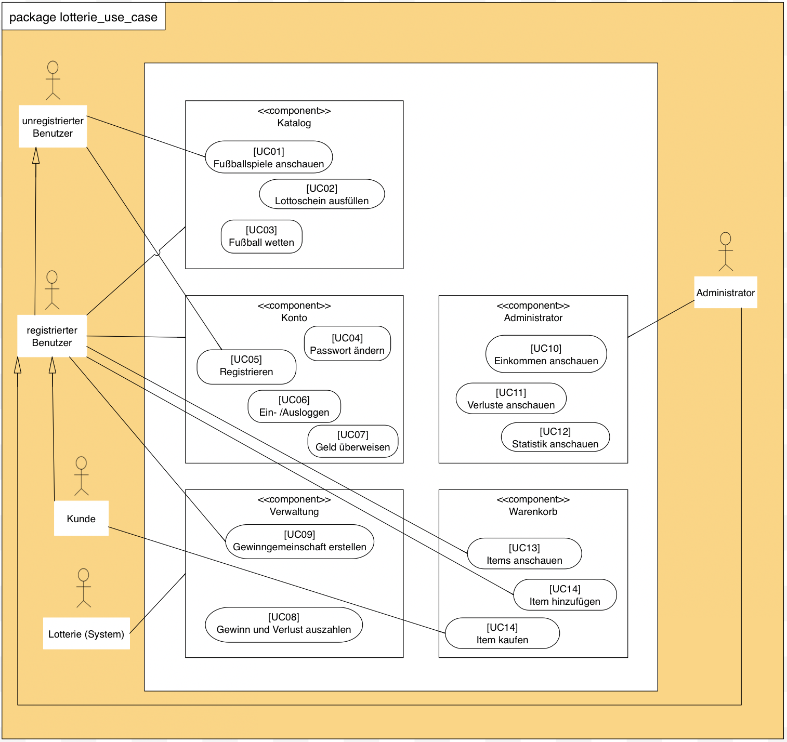
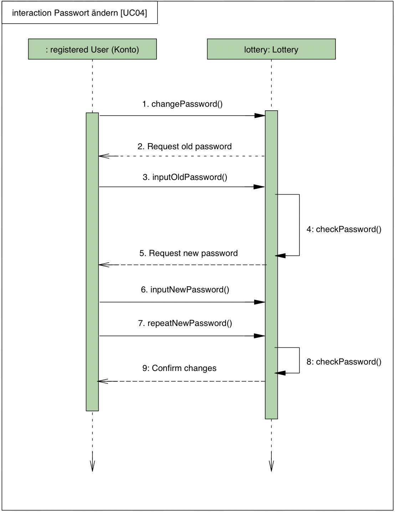
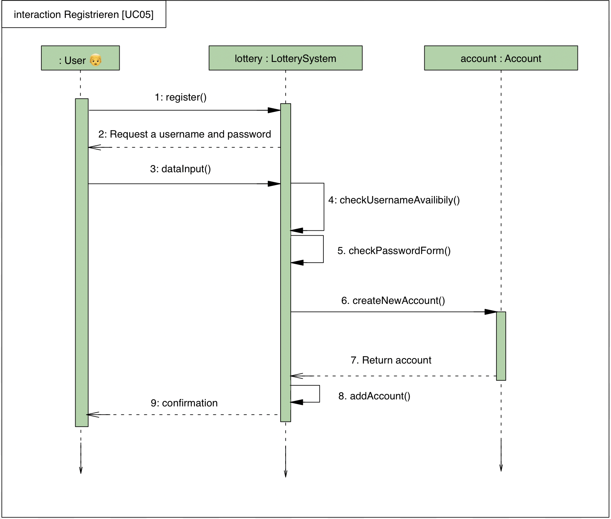
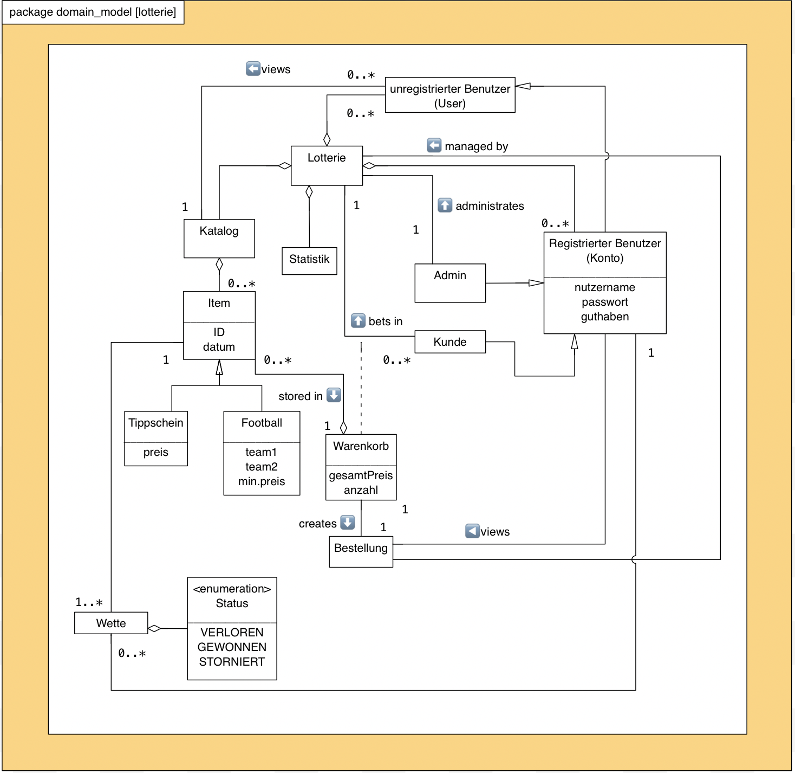

= Pflichtenheft
:project_name: Projektname
== __{project_name}__

[options="header"]
[cols="1, 1, 1, 1, 4"]
|===
|Version | Status      | Bearbeitungsdatum   | Autoren(en) |  Vermerk
|0.1     | In Arbeit   | 10.10.2021          | Autor       | Initiale Version
|0.2     | In Arbeit   | 22.10.2021          | Mirek Král  | Ergänzung des Pflichtenhesftes
|0.3     | In Arbeit   | 22.10.2021          | Sophie Schulze  | Ergänzung: Beschreibung der Use Cases
|0.4     | In Arbeit   | 22.10.2021          | Song Bai    | Ergänzung der Beschreibung
|0.5     | In Arbeit   | 25.10.2021          | Alle Gruppenmitglieder | Ergänzung des Pflichtenhesftes
|0.6     | In Arbeit   | 26.10.2021          | Yu-Ju Chen | Ergänzung: Use Cases-Beschreibung
|0.7     | In Arbeit   | 26.10.2021          | Sophie Schulze a| 
- Zusammenfassung
- Beschreibung UC02
- Korrektur Rechtschreibung
- Beginn Klassen und Enumerationen
|0.8     | In Arbeit   | 27.10.2021          | Sophie Schulze | Use Cases 13,14,15
|0.9     | In Arbeit   | 27.10.2021          | Yu-Ju Chen | Ergänzung: Use Cases-Beschreibung
|0.10    | In Arbeit   | 27.10.2021          | Mirek Král, Song Bai |Bilder hochladen und UC Ergänzung
|0.11    | In Arbeit   | 28.10.2021          | Sophie Schulze a| 
- Muss- und Kann Kriterien
- Akzeptanztestfälle hinzugefügt
|===

== 1. Inhaltsverzeichnis
Dieses Dokument benötigt ein Inhaltsverzeichnis. Es existieren mehrere Einbindungsmöglichkeiten.
_Inhalt_
 
  1. Inhaltsverzeichnis
  2. Zusammenfassung
  3. Aufgabenstellung
  4. Produktnutzung
  5. Interessensgruppen (Stakeholders)
  6. Systemgrenze und Top-Level-Architektur
  
  6.1. Kontextdiagramm
  6.2. Top-Level-Architektur
  6.3. Anwendungsfälle
  
  7. Use-Case
  
  7.1  Akteure
  7.2  Überblick Anwendungsfalldiagramm
  7.3  Anwendungsfallbeschreibungen
  
  8. Funktionale Anforderungen
  9. Nicht-Funktionale Anforderungen
  
  9.1  Qualitätsziele
  9.2  Konkrete Nicht-Funktionale Anforderungen
  
  10. GUI Prototyp
  11. Datenmodell
  
  11.1  Überblick: Klassendiagramm
  11.2  Klassen und Enumerationen
  
  12. Akzeptanztestfälle
  13. Glossar
  14. Offene Punkte

== 2. Zusammenfassung
Eine kurze Beschreibung des Dokuments. Wenige Absätze.

Im Folgenden befindet sich das Pflichtenheft zur Aufgabe Lotterie der Gruppe swt21w09. Das Heft beinhaltet die fundamentalste Eingeschaften des angestrebten Systems und bildet somit die Grundlage des Projekts. Weiterhin wird in diesem Dokument spezifiziert welche Anforderungen, die Software am Ende des Entwicklungsprozesses zu erüllen hat.

Außerdem ist das Pflichtenheft als Vertrag zwischen dem Kunden und dem Entwicklerteam anzusehen und es stellt vor wie das Problem bzw. der Auftrag des Kunden gelöst werden soll.

== 3. Aufgabenstellung und Zielsetzung
Text aus Aufgabenstellung kopieren und ggfs. präzisieren.
Insbesondere ergänzen, welche Ziele mit dem Abschluss des Projektes erreicht werden sollen.

Lotterie 

In unserem kleinen Nachbarland Gamblien ist die staatlich betriebene Lotterie Mach Dein Glück!! sehr populär. In Staatsbesitz befindet sich auch das weitverbreitete Netz an Annahmestellen.
Gambliens Wirtschaftsminister Lottermann plant den Einstieg in die "virtuelle Lotterie", um auch Ausländer als Kunden zu gewinnen. Vorbereitend sollen der aktuelle Betrieb der Lotterie und der Annahmestellen auf Computer umgestellt und auf dieser Basis neue Dienste erprobt werden.
Aktuell gibt es bei Mach Dein Glück!! eine Zahlenlotterie mit wöchentlicher Ziehung und ein Fußballtoto.
Die Lotterie Mach Dein Glück!! ist eine ganz konventionelle Lotterie "6 aus 49 mit Zusatzzahl". Tippscheine werden an den Annahmestellen bis zum Samstag eingereicht; am Sonntag erfolgt unter strenger notarieller Aufsicht die Ziehung.
Das Fußballtoto bezieht sich mangels eigener Liga auf die oberen beiden Klassen der deutschen Bundesliga. Tippscheine können bis 24 Stunden vor Beginn des Spieltags (evtl. auf mehrere Spieltage verteilt und erst mit dem letzten Nachholspiel beendet) in Bundesliga bzw. Pokalrunden eingereicht werden.
Bei der Zahlenlotterie können derzeit neben Einzeltippscheinen auch Dauertippscheine (monatlich, halb- bzw. ganzjährig) erworben werden. Tippscheine für das Fußballtoto können ab Veröffentlichung der Spielkalender beliebig im Voraus ausgefüllt und abgegeben werden. Nach Minister Lottermanns Plänen soll das Angebot künftig gemäß den neuen Medien flexibler gestaltet sein:

• Es werden Gewinngemeinschaften unterstützt. Beim Einrichten einer Gewinngemeinschaft wird von der Lotterie ein Gemeinschafts-Passwort vergeben. Wer das Gemeinschafts-Passwort kennt, darf für die Gemeinschaft einen Tipp abgeben und darf seinerseits an Personen Mitglieder-Passwörter vergeben. Mit dem Mitglieder-Passwort kann die Person ihre Anteile (ganzzahlige Vielfache des Grundeinsatzes) bis jeweils vor Wettschluss (gegen Bar- bzw. Vorauszahlung) erhöhen oder verringern bzw. zeitweilig ganz aussetzen.

• Änderungen am Tipp bzw. Einsatz sind bis jeweils 5 Minuten vor Beginn einer Auslosung bzw. eines Fußballspieltags möglich.

• An die Stelle von Bareinzahlung sollen künftig Abbuchungen von Konten bei der Lotteriebank treten, die jeder Kunde dort einrichtet und auf die er bar oder per Überweisung rechtzeitig seine Einsätze überträgt. Von diesem Konto werden (in der Reihenfolge der Auslosungen) Einsätze abgebucht. Bei nicht ausreichender Deckung erhält der Kunde eine entsprechende Mitteilung und nimmt an dieser Verlosung nicht teil. Je Mitteilung wird eine Gebühr von 2 € erhoben; nach zehn Mitteilungen wird der Kunde vorläufig aus seinen Gewinngemeinschaften entfernt.

• Administratoren der Lotterie sollen die Möglichkeit haben, jederzeit eine Übersicht über die abgegebenen Wetten der Kunden und die finanzielle Situation (Gewinne/Verluste) der Lotterie nach dem jeweiligen Ziehungstagen und Spieltagen zu bekommen.

• Minister Lottermann hat unter dem Aktenzeichen "MDG 2000" eine Ausschreibung veröffentlicht, und um Einreichung geeigneter, künftig ausbaubarer Prototypen für ein solches System gebeten. Ihr SalesPoint-Team hat zufällig davon erfahren und beabsichtigt, an dem Wettbewerb teilzunehmen.
Die Lotteriebetreiber wären daran interessiert, ihre Fußballtoto-Daten direkt und aktuell aus dem Internet zu beziehen. Wenn der Prototyp dies demonstrieren würde, sähe man das als ein besonderes Plus an.

== 4. Produktnutzung
In welchem Kontext soll das System später genutzt werden? Welche Rahmenbedingungen gelten?
Zusätzlich kurze Einleitung für fachfremde Personen

Das System soll die Struktur der Lotterie digitalisieren. Die Kuden dürfen online wetten, Tippscheine ausfüllen und sich über Spielregeln informieren ohne an eine Filiale gebunden zu sein. Nebenbei soll das System die Welt der Lotterie auch internationalen Kunden eröffnen. Ein großer Vorteil besteht darin, dass die Online-Lotterie 24/7 geöffnet ist.

Das System soll von folgenden Web-Browsers unterstütz werden

• Mozila Firefox v93.0+
• Google Chrome 94.0+
• Microsoft Edge 95.0+
• Safari v15.0+

== 5. Interessensgruppen (Stakeholders)
Welche realen und juristischen Personen(-gruppen) haben Einfluss auf die Anforderungen im Projekt?

Prorität:1 (niedrig) zu 5 (hoch)

[options="header", cols="5h, ^1, ^1, ^1"]
|===
|Name            | Priorität (1..5) | Beschreibung                                                                             | Ziele
|André Schmidt   | 5                | Der Auftraggeber unseres Projektes                                                      a| 
• Kundenbereich erweitern
• Digitalisierung
• Geld sparen
• Effizienz der Struktur (Einsparung bei Mitarbeiter, Material etc.)
|Kunden          | 5                | Sie stellen die grösste Interessengruppe dar und sorgen für das Einkommen der Lotterie. a| 
• Geld gweinnen
• intuitive Handhabung
• guter Kunden-Service
|Administrator   | 3                | Er behält den Überblick über den Gewinn und die Verluste der Lotterie.                  a|
• Überblick über Finanzen haben
|Entwickler      | 3                | Sie sind für die Entwicklung/Programmierung und Wartung der Website zuständig.          a| 
• leicht verstehbarer / aufgeräumter Code
• keine ,,Bananaware"
• leicht erweiterbarer Code
|===

Das Interessengruppen sind ausschließlich Erwachsene, d.h. Personen ab 18 Jahre alt.

== 6. Systemgrenze und Top-Level-Architektur

=== 6.1. Kontextdiagramm
Das Kontextdiagramm zeigt das geplante Software-System in seiner Umgebung. Zur Umgebung gehören alle Nutzergruppen des Systems und Nachbarsysteme. Die Grafik kann auch informell gehalten sein. Überlegen Sie sich dann geeignete Symbole. Die Grafik kann beispielsweise mit Visio erstellt werden. Wenn nötig, erläutern Sie diese Grafik.

[[context_diagram]]

=== 6.2. Top-Level-Architektur
[[TLA]]
image:diagramm/top_level.png[top-level architecture]

Top-Level-Ansicht für Lotteriesystem

== 7. Use-Cases

=== 7.1  Akteure

Akteure sind die Benutzer des Software-Systems oder Nachbarsysteme, welche darauf zugreifen. Dokumentieren Sie die Akteure in einer Tabelle. Diese Tabelle gibt einen Überblick über die Akteure und beschreibt sie kurz. Die Tabelle hat also mindestens zwei Spalten (Akteur Name und Kommentar).
Weitere relevante Spalten können bei Bedarf ergänzt werden.

// See http://asciidoctor.org/docs/user-manual/#tables
[options="header"]
[cols="1,4"]
|===
|Name                         |Beschreibung
|Kunde                        |Der Kunde kann alles machen, was der registrierter Benutzer kann. Der entscheidende Unterschied ist, er kann bezahlen.
|registrierter Benutzer       |Dem registrierten Benutzer werden die eigentlichen Funktionalitäten der Internet-Lotterie eröffnet.

Ein registrierter Benutzer hat die Möglichkeit entweder am Fußballtoto oder an der Zahlenlotterie teilzunehmen. Dafür muss er sein virtuelles Portemonnaie mit Geld aufladen. Zusätzlich kann er sein Passwort ändern.
|unregistrierter Benutzer     |Der unregistrierte Benutzer ist als die Person angesehen, die beispielsweise das Web-Portal der Lotterie zum ersten Mal besucht, d.h. "Ausländer", bzw. neue potenzielle Kunden. 

Er kann sich den Katalog der Fußballspiele anschauen sowie evtl. sich über die Spielregeln der Zahlenlotterie informieren. Weiterhin kann er sich registrieren, was schließlich seine Rolle als unregistrierter Benutzer beendet.
|Administrator                |Dieser ist die meiste Zeit nur ein gewisser Zuschauer der ganzen Struktur. Er schaut sich die generierte Statistik an. Er kann im Laufe des Betriebes mit neunen Funktionalitäten kommen, die ein neues Service für die Kunden darstellen.
|Lotterie (System)            |Diese ist eine virtuelle Rolle, die für den allgemeine Betrieb der ganzen Struktur sorgt. Sie speichert alle registrierte Benutzer, generiert Passwörter für Gewinnsgemeinschaftsgruppen, gründet und erweitert die Statistik der Verluste und Gewinne. 

Bemerkung: Sie bekommt einen offiziellen Name später in der Entwicklung.
|===

=== 7.2 Überblick Use-Case-Diagramm
[[use_case_diagram]]

=== 7.3 Use-Case-Beschreibungen
Dieser Unterabschnitt beschreibt die Anwendungsfälle. In dieser Beschreibung müssen noch nicht alle Sonderfälle und Varianten berücksichtigt werden. Schwerpunkt ist es, die wichtigsten Anwendungsfälle des Systems zu finden. Wichtig sind solche Anwendungsfälle, die für den Auftraggeber, den Nutzer den größten Nutzen bringen.
Für komplexere Anwendungsfälle ein UML-Sequenzdiagramm ergänzen.
Einfache Anwendungsfälle mit einem Absatz beschreiben.
Die typischen Anwendungsfälle (Anlegen, Ändern, Löschen) können zu einem einzigen zusammengefasst werden.

In Folgenden werden die im Anwendungsfalldiagramm gezeigten Anwendungsfälle im Detail beschrieben.

[cols="1h, 3"]
[[UC01]]
|===
|ID                         |**<<UC01>>**
|Name                       |Fußballspiele anschauen          
|Beschreibung               |Der Nutzer kann den Fußballwettenkatalog aufrufen, um zu sehen auf welche Fußballspiele man wetten kann.
|Akteur                     |alle Nutzer der Website
|Auslöser                   |(später: Durch Klicken auf den Menüpunkt Fußballkatalog)
|Vorbedingung               |keine 
|Grundlegende Schritte     a|
_Fußballspiele anschauen:_ 

  1. Nutzer klickt auf Menüpunkt Fußballkatalog.
  2. Nutzer sieht Liste mit kommenden Fußballspielen
 
|Extensions                 |-
|Funktionale Anforderungen  |**<<FA04>>**
|===

[[sequence_diagram_watch_football]]

[cols="1h, 3"]
[[UC02]]
|===
|ID                         |**<<UC02>>**
|Name                       |Lottoschein ausfüllen          
|Beschreibung               |Ein registrierter Nutzer füllt einen Lottoschein aus, indem er 6 aus 49 Zahlen auswählt. 
|Akteur                     |registrierter Benutzer
|Auslöser                   |-
|Vorbedingung               |Der Benutzer muss sich registrieren und eingeloggt werden, um Lotoscheine ausfüllen zu können. 
|Grundlegende Schritte     a|
• Einloggen unter Gruppe oder einzeln
• Katalog anschauen
• 6 Zahlen aus 49 Zahlen wählen
|Extensions                 |-
|Funktionale Anforderungen  |**<<FA02>>**, **<<FA09>>**
|===

[cols="1h, 3"]
[[UC03]]
|===
|ID                         |**<<UC03>>**
|Name                       |Fußballwetten        
|Beschreibung               |Die Kunden entscheiden sich zuerst dafür, eine Wette auf das Gewinnerteam zu platzieren, und sie können auch den Spielstand zusätzlich addieren und dann schließlich mit den Quoten multiplizieren, um den Gewinnbetrag zu erhalten.
|Akteur                     |Kunden
|Auslöser                   |Zugriff auf Menüpunkt Fußballkatalog, der fürs Fußballtoto verantwortlich ist.
|Vorbedingung              a|
• Einloggen unter Gruppe oder einzeln
• Katalog anschauen
• Spiel wählen
|Grundlegende Schritte     a|
_Wetten:_ 

  1. Kunden wählen das Geweinnerteam oder unentscheiden
  2. Kunden entscheiden sich, ob sie die Spielstand hochheben
  3. Multipliziert mit der Gewinnwahrscheinlichkeit ergibt sich der erwartete Gewinnbetrag
|Extensions                 |-
|Funktionale Anforderungen  |**<<FA03>>**,**<<FA04>>**, **<<FA09>>**
|===

[cols="1h, 3"]
[[UC04]]
|===
|ID                         |**<<UC04>>**
|Name                       |Passwort ändern          
|Beschreibung               |Der Benutzer soll sein eigenes Passwort ändern können.
|Akteur                     |registrierter Benutzer
|Auslöser                   |-
|Vorbedingung               |Der Benutzer muss sich registrieren und eingeloggt werden. 
|Grundlegende Schritte     a|

* Nutzer klikt auf Einstellungen "change Password".
* Nutzer geben altes Passwort, neues Passwort ab, und wiederholt sich nochmal neues Passwort um alle zu bestätigen.
** Falls die Eingabe korrekt war: Nutzer wird zur Startseite weitergeleitet.
** Sonst: Eine Fehlermeldung wird angezeigt.

|Extensions                 |-
|Funktionale Anforderungen  |**<<FA10>>**, **<<FA09>>**
|===

[[sequence_diagram_change_password]]

[cols="1h, 3"]
[[UC05]]
|===
|ID                         |**<<UC05>>**
|Name                       |Registrierung          
|Beschreibung               |Damit sich ein potenzieller Kunde aktiv an der Zahlenlotterie, bzw. Fußballtoto teilnehmen kann, muss ihm ermöglicht werden sich zu registrieren. Diese Funktion bildet die Grundlage neuer Funktionalitäten z.B. Passwort ändern, Ein-/Ausloggen, Geldüberweisen, etc..
|Akteur                     |unregistrierter Benutzer
|Auslöser                   |
_Registration:_ Unregistrierter Benutzer möchte den Zutritt zur Teilnahme an den jeweiligen Angebote der Lotterie.
|Vorbedingung               |Der Benutzer wurde nicht bereits registriert.
|Grundlegende Schritte     a|
_Registration:_ 

  1. Eingabe eines bereits nicht besetzten Benutzernamens.
  2. Eingabe eines Passwortes (Mit Hinsicht auf die Kriterien)
 
|Extensions                 |-
|Funktionale Anforderungen  |**<<FA01>>**
|===

[[sequence_diagram_registration]]

[cols="1h, 3"]
[[UC06]]
|===
|ID                         |**<<UC06>>**
|Name                       |Ein-/Ausloggen          
|Beschreibung               |Ein Benutzer muss sich beim System anmelden(authentifizieren) können, um auf weitere Funktionen zuzugreifen. 
 Dieser Vorgang soll durch Ausloggen rückgängig gemacht werden können.
|Akteur                     |Benutzer
|Auslöser                  a|

 Einloggen: Benutzer möchte auf weitere Funktionen zugreifen, indem er sich einloggt.
 Ausloggen: Benutzer möchte die Website verlassen.
|Vorbedingung              a|
 Einloggen: Benutzer ist noch nicht authentifiziert
 Ausloggen: Benutzer ist authentifiziert
|Grundlegende Schritte     a|
_Einloggen:_

  1.  Benutzer greift in der Startseite auf “log in” zu
  2.  Benutzer gibt seine Zugangsdaten ein
  3.  Benutzer klickt auf “log in”
  
_Ausloggen:_

  1.  Benutzer klickt auf “log out”
  2.  Benutzer ist nicht authentifiziert und die Startseite wird angezeigt 
|Extensions                 |-
|Funktionale Anforderungen  |**<<FA09>>**
|===

[cols="1h, 3"]
[[UC07]]
|===
|ID                         |**<<UC07>>**
|Name                       |Geld überweisen
|Beschreibung               |Der registiered Benutzer kann seine Guthaben mit einem bestimmten Betrag aufladen.
|Akteur                     |Kunde
|Auslöser                   |Kunde möchte an der Lotterie finanziell teilnehmen.
|Vorbedingung               |Der Nutzer ist bereits im System eingeloggt.
|Grundlegende Schritte     a|
_Geld　überweisen:_ 

  1. Nutzer meldet sich an.
  2. Nutzer klickt auf Guthaben aufladen.
  3. System lädtet Guthaben auf. 
 
|Extensions                 |-
|Funktionale Anforderungen a|**<<FA08>>**,**<<FA09>>**
|===

[[sequence_diagram_transfer]]

[cols="1h, 3"]
[[UC08]]
|===
|ID                         |**<<UC08>>**
|Name                       |Gewinn und Verlust auszahlen
|Beschreibung               |Das System wertet die abgegebenede Wetten und Tippscheinen aus und zahlt entsprechend des Ergibnisses ein Gewinn bzw. Verlust aus oder nicht.
|Akteur                     |Lotterie
|Auslöser                   |Kunde hat verloren oder gewonnen.
|Vorbedingung               |Lotterie kennt das Ergibnis des Spieles oder der Ziehungs.
|Grundlegende Schritte     a|
_Gewinn und Verlust auszahlen:_ 

  1. Das Ergebnis von der Zahlenlotterie und dem Fußballspiel ist bekannt.
  2. Lotterie guckt in die Statistik ob Kunde Geld gewonnen oder verloren. 
  3. System zahlt ein Gewinn oder Verlust aus. 
 
|Extensions                 |-
|Funktionale Anforderungen a|-
|===

[[sequence_diagram_win_or_lose]]

[cols="1h, 3"]
[[UC09]]
|===
|ID                         |**<<UC09>>**
|Name                       |Gewinngruppe erstellen          
|Beschreibung               |Ein angemeldeter/registrierter Nutzer kann eine Gewinngemeinschaft erstellen. Das System generiert für die Gruppe ein Passwort,
das der Ersteller an neue Mitglieder weitergeben kann.
|Akteur                     |registrierter Nutzer
|Auslöser                   |-
|Vorbedingung               |Der Nutzer ist bereits im System registriert, hat also einen Benutzernamen sowie ein Passwort und muss sich vor dem Erstellen der Gruppe anmelden.
|Grundlegende Schritte     a|
_Gewinngemeinschaft erstellen:_ 

  1. Nutzer meldet sich an.
  2. Nutzer klickt auf Gewinngemeinschaft erstellen.
  3. System generiert Passwort (hinsichtlich der Kriterien).
  4. System teilt dem Nutzer das Gruppenpasswort mit.
  5. System schickt Bestätigung für Erstellung der Gruppe.
 
|Extensions                 |-
|Funktionale Anforderungen  |**<<FA11>>**,**<<FA09>>**
|===

[[sequence_diagram_make_group]]

[cols="1h, 3"]
[[UC10]]
|===
|ID                         |**<<UC10>>**
|Name                       |Einkommen anschauen          
|Beschreibung               |Der Admin möchtet die Einkommen des Kunden anschauen.
|Akteur                     |Administrator
|Auslöser                   |Admin hat das Recht auf Einsicht in des Einkommen des Kunden.
|Vorbedingung               |- 
|Grundlegende Schritte     a|

* Admin drückt auf "Statistik" in der Navigationsliste.
* Die Liste aller Kunden wird angezeigt.
* Die Einkommen und Verluste aller registrirten Kunden werden angezeigt.

|Extensions                 |-
|Funktionale Anforderungen  |-
|===

[cols="1h, 3"]
[[UC10]]
|===
|ID                         |**<<UC11>>**
|Name                       |Verluste anschauen          
|Beschreibung               |Der Admin möchtet die Verluste des Kunden anschauen.
|Akteur                     |Administrator
|Auslöser                   |Admin hat das Recht auf Einsicht in der Verluste des Kunden.
|Vorbedingung               |- 
|Grundlegende Schritte     a|

* Admin drückt auf "Statistik" in der Navigationsliste.
* Die Liste aller Kunden wird angezeigt.
* Die Einkommen und Verluste aller registrirten Kunden werden angezeigt.

|Extensions                 |-
|Funktionale Anforderungen  |-
|===

[cols="1h, 3"]
[[UC12]]
|===
|ID                         |**<<UC12>>**
|Name                       |Statistik anschauen          
|Beschreibung               |Der Admin möchte Übersicht über auskommenden und einkommenden Geld anschauen.
|Akteur                     |Administrator
|Auslöser                   |Admin gibt den Befehl die Übersicht zu sehen.
|Vorbedingung               |- 
|Grundlegende Schritte     a|

* Admin drückt auf "bet management" in der Navigationsliste.
* Die Liste aller Wetten wird angezeigt.

|Extensions                 |-
|Funktionale Anforderungen  |**<<FA12>>**
|===

[cols="1h, 3"]
[[UC013]]
|===
|ID                         |**<<UC013>>**
|Name                       |Items anschauen        
|Beschreibung               |ein registrierter Benutzer kann die Waren im Warenkorb ansehen.
|Akteur                     |registrierter Benutzer
|Auslöser                   |Klick auf "Warenkorb" in Menüleiste
|Vorbedingung               |Nutzer ist registriert im System und angemeldet. 
|Grundlegende Schritte     a|

  1. registrierter Nutzer klickt auf "Warenkorb" in Menüleiste
  2. registrierter Nutzer sieht Items im Warenkorb

|Extensions                 |-
|Funktionale Anforderungen  |**<<FA05>>**,**<<FA09>>**
|===

[cols="1h, 3"]
[[UC014]]
|===
|ID                         |**<<UC014>>**
|Name                       |Item hinzufügen        
|Beschreibung               |ein registrierter Nutzer kann ein Item zu seinem Warenkorb hinzufügen
|Akteur                     |registrierter Nutzer
|Auslöser                   |ein registrierter Nutzer hat eine Wette auf ein Item abgeschlossen (Tippschein ausgefüllt oder Fußballwette), und möchte dieses zum Warenkorb hinzufügen
|Vorbedingung              a|
- Nutzer ist registriert und angemeldet
- Nutzer hat Wette abgeschlossen
|Grundlegende Schritte     a|

  1. Nutzer klickt auf "zu Warenkorb hinzufügen"
  2. Item ist zu Warenkorb hinzugefügt

|Extensions                 |-
|Funktionale Anforderungen  |**<<FA06>>**,**<<FA09>>**
|===

[cols="1h, 3"]
[[UC015]]
|===
|ID                         |**<<UC015>>**
|Name                       |Item kaufen        
|Beschreibung               |Kunde kauft die Ware/n in seinem Warenkorb
|Akteur                     |Kunde
|Auslöser                   |Klick auf "Kaufen"
|Vorbedingung              a|
- Nutzer ist registriert und angemeldet
- Nutzer hat auf Menüpunkt Warenkorb geklickt
- Nutzer hat Item(s) zum Warenkorb hinzugefügt
- Nutzer hat ausreichend Guthaben auf seinem Konto
|Grundlegende Schritte     a|

  1. Nutzer klickt auf "Kaufen"
  2. Warenkorb wird geleert
  3. Kaufbetrag wird vom Guthaben des Nutzers abgezogen
|Extensions                 |-
|Funktionale Anforderungen  |**<<FA07>>**,**<<FA09>>**
|===

== 8. Funktionale Anforderungen

=== 8.1 Muss-Kriterien
_Muss-Kriterien_ 

  1. Statistik erstellen
  2. Bei Fußballtoto eine Wette abgeben und eine Liste mit kommenden Spiele anschauen.
  3. Bei Zahlenloterie Lottoschein ausfüllen.
  4. Registration für Kunden.

[options="header", cols="2h, 3, 12"]
|===
|ID
|Name
|Beschreibung

|**<<FA01>>**
|Registrierung
|Ein Nutzer muss die Möglchkeit haben sich zu registrieren, indem er auf den Menüpunkt "Registrieren" klickt.
Von dem Nutzer wird eine Eingabe erwartet:
  - Benutzernamen
  - Passwort
Das System muss überprüfen, ob der Benutzername bereits vergeben ist, wenn das der Fall ist muss ein anderer Benutzername eingegeben werden.

|**<<FA02>>**
|Lottoschein ausfüllen
|Ein registrierter Nutzer kann einen Lottoschein ausfüllen, indem er aus einer Liste von 49 Zahlen, 6 Zahlen ankreuzt.

|**<<FA03>>**
|Fußballwette abgeben
|Ein registrierter Nutzer wettet auf ein Fußballspiel, indem er auf Sieg, Niederlage oder Unentschieden tippt.

|**<<FA04>>**
|Fußballkatalog ansehen
|Allen Besuchern wird ermöglicht eine Liste mit anstehenden Fußballspielen zusehen, mit folgenden Informationen:
 - Spieltag
 - Heimmannschaft
 - Gastmannschaft

|**<<FA05>>**
|Warenkorb ansehen
|Jedem registrierten Nutzer wird im Menü "Warenkorb" angezeigt, in den er durch Anklicken dessen Inhalte ansehen kann. 

|**<<FA06>>**
|Item hinzufügen
|Wenn ein registrierter Benutzer einen Tippschein bzw. eine Fußballwette abgeben möchte, wird ihm die Option "zu Warenkorb hinzufügen" angezeigt, durch Anklicken wird dann das Item in den Warenkorb gelegt.

|**<<FA07>>**
|Item kaufen
|Im Warenkorb ist unter den enthaltenen Items ein Button "Kaufen", welcher den Kauf der Waren ermöglicht.

|**<<FA08>>**
|Geld überweisen
|Unter dem Menüpunkt "Konto" kann ein angemeldeter Benutzer seine Kontodetails einsehen. Dort gibt es ein Eingabefeld für den Überweisungsbetrag und daneben ein Button mit "überweisen" (o.ä.). Durch Klicken des Buttons wird vom System der gewünschte Betrag auf das Kontoguthaben gutgeschrieben.

|**<<FA09>>**
|Authentifizierung
|Das System muss in öffentlich zugängliche Teile und in Teile, die für den Zugriff eine Authentifizierung erfordern, getrennt werden können. Wenn ein Benutzer im System vorhanden ist (registrierter Benutzer), kann er sich durch Angabe der folgenden Informationen authentifizieren:

Nutzername

Passwort
|===

=== 8.2 Kann-Kriterien
Anforderungen die das Programm leisten können soll, aber für den korrekten Betrieb entbehrlich sind.

[options="header", cols="2h, 3, 12"]
|===
|ID
|Name
|Beschreibung

|**<<FA010>>**
|Passwort ändern
|Unter dem Menüpukt "Konto" kann ein angemeldeter Benutzer die Option "Passwort ändern" sehen, welches ihm ermöglicht sein Passwort zu ändern.

|**<<FA111>>**
|Gewinngemeinschaft erstellen
|Auf der Kontoseite eines angemeldeten Nutzers gibt es den Button "Gewinngemeinschaft erstellen". Die Anfrage wird zum Lotteriesystem weitergeleitet, welches für die Gruppe ein Passwort generiert und dem Ersteller der Gruppe mitteilt.

|**<<FA12>>**
|abgegebene Wetten anschauen
|Dem Administrator wird der Menüpunkt "Statistik" angezeigt, dort kann er einsehen welche Wetten von welchem Kunden abgegeben wurden.

|**<<FA13>>**
|Konto löschen
|Unter "Mein Profil" kann ein angemeldeter Nutzer die Option sein Konto zu löschen, d.h. die Benutzerdaten sind beim Anmelden nicht mehr gültig.
|===

== 9. Nicht-Funktionale Anforderungen

=== 9.1 Qualitätsziele

1 = Nicht wichtig
2 = Sehr wichtig
[options="header", cols="3h, ^1, ^1, ^1, ^1, ^1"]
|===
|Qualitätsanforderung | 1 | 2 | 3 | 4 | 5
|Wartbarkeit          |   |   |   | x | 
|Anwendbarkeit        |   |   | x |   | 
|Sicherheit           |   |   | x |   | 
|===

Dokumentieren Sie in einer Tabelle die Qualitätsziele, welche das System erreichen soll, sowie deren Priorität.

=== 9.2 Konkrete Nicht-Funktionale Anforderungen

[options="header"]
[cols="1, 1, 1, 1"]
|===
|ID     |Version  |Name           |Beschreibung
|[NF01] |v0.1     |Wartbarkeit    |Gut getestete Software, um möglichst viele Fehler abzudecken.
|===

Beschreiben Sie Nicht-Funktionale Anforderungen, welche dazu dienen, die zuvor definierten Qualitätsziele zu erreichen.
Achten Sie darauf, dass deren Erfüllung (mindestens theoretisch) messbar sein muss.

== 10. GUI Prototyp

In diesem Kapitel soll ein Entwurf der Navigationsmöglichkeiten und Dialoge des Systems erstellt werden.
Idealerweise entsteht auch ein grafischer Prototyp, welcher dem Kunden zeigt, wie sein System visuell umgesetzt werden soll.
Konkrete Absprachen - beispielsweise ob der grafische Prototyp oder die Dialoglandkarte höhere Priorität hat - sind mit dem Kunden zu treffen.

=== 10.1 Überblick: Dialoglandkarte
Erstellen Sie ein Übersichtsdiagramm, das das Zusammenspiel Ihrer Masken zur Laufzeit darstellt. Also mit welchen Aktionen zwischen den Masken navigiert wird.
//Die nachfolgende Abbildung zeigt eine an die Pinnwand gezeichnete Dialoglandkarte. Ihre Karte sollte zusätzlich die Buttons/Funktionen darstellen, mit deren Hilfe Sie zwischen den Masken navigieren.

=== 10.2 Dialogbeschreibung
Für jeden Dialog:

1. Kurze textuelle Dialogbeschreibung eingefügt: Was soll der jeweilige Dialog? Was kann man damit tun? Überblick?
2. Maskenentwürfe (Screenshot, Mockup)
3. Maskenelemente (Ein/Ausgabefelder, Aktionen wie Buttons, Listen, …)
4. Evtl. Maskendetails, spezielle Widgets

== 11. Datenmodell

=== 11.1 Überblick: Klassendiagramm

[[AKD]]

UML-Analyseklassendiagramm

=== 11.2 Klassen und Enumerationen
Dieser Abschnitt stellt eine Vereinigung von Glossar und der Beschreibung von Klassen/Enumerationen dar. Jede Klasse und Enumeration wird in Form eines Glossars textuell beschrieben. Zusätzlich werden eventuellen Konsistenz- und Formatierungsregeln aufgeführt.

// See http://asciidoctor.org/docs/user-manual/#tables
[options="header"]
|===
|Klasse/Enumeration |Beschreibung

|Lotterie                  
|repräsentiert das Lotteriesystem

| Benutzer                
| repräsentiert eine Person, die die Website benutzt bzw. besucht           

|registrierter Benutzer                  
|eine Person, die bereits im System registriert und authentifiziert ist; hat einen Benutzernamen und ein Passwort

|Kunde                  
|ein registrierter Nutzer, der für ein Produkt der Lotterie bezahlt

|Admin                  
|registrierter Nutzer, der durch seine Anmeldedaten vom System als Administrator erkannt wird

|Statistik
|gitb Auskkunft über Einkommen und Verluste der Lotterie sowie über die abgegebenen Wetten der Nutzer

|Katalog
a|
- enthält Items der Zahlenlotterie und Fußballlotterie

|Item
a|
- stehen im Katalog
- ist ein Tippschein (Zahlenlotterie) oder Fußballspiel (Fußballtoto)
- kann eindeutig identifiziert werden (ID)
- darauf wird 1 oder mehrere Wetten abgegeben von einem Nutzer

|Tippschein
a|
- Item für die Zahlenlotterie
- besteht aus 49 Zahlen

|Foootball
a|
- repräsentiert ein Fußballspiel
- hat Heim- und Gastmannschaft
- min_preis beschreibt den Mindesteinsatz für die Wette

|Wette
a|
- wird auf ein Item abgegeben
- für Tippschein: gemeint sind die 6 aus 49 ausgwählten Zahlen
- für Football: Wette auf Sieg einer Mannschaft bzw. Unentschieden
- gehört zu einem registrierten Nutzer, der die Wette abgegeben hat

|Warenkorb
|enthält Items, die ein Nutzer kaufen möchte

|Bestellung
|

|Status
|
|===

== 12. Akzeptanztestfälle
Mithilfe von Akzeptanztests wird geprüft, ob die Software die funktionalen Erwartungen und Anforderungen im Gebrauch erfüllt. Diese sollen und können aus den Anwendungsfallbeschreibungen und den UML-Sequenzdiagrammen abgeleitet werden. D.h., pro (komplexen) Anwendungsfall gibt es typischerweise mindestens ein Sequenzdiagramm (welches ein Szenarium beschreibt). Für jedes Szenarium sollte es einen Akzeptanztestfall geben. Listen Sie alle Akzeptanztestfälle in tabellarischer Form auf.
Jeder Testfall soll mit einer ID versehen werde, um später zwischen den Dokumenten (z.B. im Test-Plan) referenzieren zu können.

[cols="1h, 4"]
|===
|ID             |<<AT01>>
|Use Case       |<<UC01>>
|Vorbedingung  a|Der Katalog enthält Fußballspiele.
|Aktion        a|Ein unregistrierter Nutzer klickt auf "Katalog".
|Ergebnis       |Dem Nutzer werden die eingetragenen Fußballspiele angezeigt.
|===

[cols="1h, 4"]
|===
|ID             |<<AT02>>
|Use Case       |<<UC01>>
|Vorbedingung  a|Der Katalog enthält Fußballspiele.
|Aktion        a|Ein registrierter Nutzer klickt auf "Katalog".
|Ergebnis       |Dem registrierten Nutzer werden die eingetragenen Fußballspiele angezeigt.
|===

[cols="1h, 4"]
|===
|ID             |<<AT03>>
|Use Case       |<<UC02>>
|Vorbedingung  a|Der Nutzer ist registriert und angemeldet.
|Aktion        a|Der Nutzer hat "Zahlenlotterie" ausgewählt.
|Ergebnis       |Dem Nutzer wird die Zahlen 1 bis 49 angezeigt, von denen er 6 auswählen kann.
|===

[cols="1h, 4"]
|===
|ID             |<<AT04>>
|Use Case       |<<UC03>>
|Vorbedingung  a|Der Katalog enthält Fußballspiele.
|Aktion        a|Ein unregistrierter Nutzer klickt auf "Katalog".
|Ergebnis       |Dem Nutzer werden die eingetragenen Fußballspiele angezeigt, aber nicht die Option eine Wette abzugeben.
|===

[cols="1h, 4"]
|===
|ID             |<<AT05>>
|Use Case       |<<UC03>>
|Vorbedingung  a|Der Katalog enthält Fußballspiele, Nutzer ist registriert
|Aktion        a|Der Nutzer klickt auf "Katalog".
|Ergebnis       |Dem Nutzer werden die eingetragenen Fußballspiele angezeigt und auch die Option eine Wette abzugeben.
|===

[cols="1h, 4"]
|===
|ID             |<<AT06>>
|Use Case       |<<UC04>>
|Vorbedingung  a|Der Nutzer ist registriert.
|Aktion        a|Der Nutzer klickt auf "Passwort ändern".
|Ergebnis       |Der Nutzer muss sein altes und ein neues Passwort eingeben. Es wird eine Bestätigung angezeigt.
|===

[cols="1h, 4"]
|===
|ID             |<<AT07>>
|Use Case       |<<UC05>>
|Vorbedingung  a|Der Nutzer ist nicht registriert.
|Aktion        a|Es wird ein bereits vergebener Benutzername eingegeben.
|Ergebnis       |Der Nutzer wird aufgefordert einen anderen Benutzernamen einzugeben.
|===

[cols="1h, 4"]
|===
|ID             |<<AT08>>
|Use Case       |<<UC06>>
|Vorbedingung  a|Der Nutzer ist nicht registriert.
|Aktion        a|Es wird ein noch nicht vergebener Benutzername  und ein form-korrektes Passwort eingegeben.
|Ergebnis       |Der Nutzer wird im System registriert und kann sich jetzt anmelden.
|===

[cols="1h, 4"]
|===
|ID             |<<AT09>>
|Use Case       |<<UC05>>
|Vorbedingung  a|Der Nutzer ist nicht registriert.
|Aktion        a|Es wird ein noch nicht vergebener Benutzername und ein form-widersprüchliches Passwort eingegeben.
|Ergebnis       |Der Nutzer wird aufgefordert ein Passwort, das den Kriterien entspricht, einzugeben.
|===

[cols="1h, 4"]
|===
|ID             |<<AT10>>
|Use Case       |<<UC06>>
|Vorbedingung  a|Der Nutzer ist registriert.
|Aktion        a|Es wird der richtige Benutzername und das richtige Passwort eingegeben.
|Ergebnis       |Der Nutzer ist angemeldet und hat Zugriff auf seinen Warenkorb und kann wetten.
|===

[cols="1h, 4"]
|===
|ID             |<<AT11>>
|Use Case       |<<UC06>>
|Vorbedingung  a|Der Nutzer ist registriert.
|Aktion        a|Es werden falsche Benutzerdaten eingegeben.
|Ergebnis       |Es wird angezeigt, dass die eingegebenen Daten nicht gültig sind.
|===

[cols="1h, 4"]
|===
|ID             |<<AT12>>
|Use Case       |<<UC05>>
|Vorbedingung  a|Der Nutzer ist angemeldet.
|Aktion        a|Der Nutzer loggt sich aus.
|Ergebnis       |Der Nutzer verliert Zugriff auf die Funktionalitäten, die nur angemeldeten Nutzern zur Verfügung stehen,z.B. zu wetten.
|===

[cols="1h, 4"]
|===
|ID             |<<AT13>>
|Use Case       |<<UC07>>
|Vorbedingung  a|Der Nutzer ist angemeldet.
|Aktion        a|Es wird ein Betrag, der größer 0 ist, eingegeben..
|Ergebnis       |Das Guthaben erhöht sich um den eingegebenen Betrag.
|===

[cols="1h, 4"]
|===
|ID             |<<AT14>>
|Use Case       |<<UC07>>
|Vorbedingung  a|Der Nutzer ist angemeldet.
|Aktion        a|Es wird ein negativer Betrag eingegeben.
|Ergebnis       |Es wird angezeigt, dass der Betrag größer als 0 sein muss. Das Guthaben des Kontos bleibt gleich.
|===

[cols="1h, 4"]
|===
|ID             |<<AT15>>
|Use Case       |<<UC08>>
|Vorbedingung  a|Der Nutzer hat eine Fußballwette abgegeben.
|Aktion        a|Das Ergebnis des Fußballspiels stimmt mit der Wette des Nutzers überein.
|Ergebnis       |Das Guthaben des Nutzers wird erhöht.
|===

[cols="1h, 4"]
|===
|ID             |<<AT16>>
|Use Case       |<<UC09>>
|Vorbedingung  a|Der Nutzer ist angemeldet.
|Aktion        a|Der Nutzer klickt auf "Gewinngemeinschaft erstellen".
|Ergebnis       |Das System generiert ein Passwort für die Gruppe. Dem Nutzer wird das Passwort angezeigt.
|===

[cols="1h, 4"]
|===
|ID             |<<AT17>>
|Use Case       |<<UC10>>
|Vorbedingung  a|Der Nutzer ist als Administrator angemeldet.
|Aktion        a|Es wird "Statistik" angeklickt.
|Ergebnis       |Dem Administrator wird das Einkommen der Lotterie angezeigt.
|===

[cols="1h, 4"]
|===
|ID             |<<AT18>>
|Use Case       |<<UC11>>
|Vorbedingung  a|Der Nutzer ist als Administrator angemeldet.
|Aktion        a|Es wird "Statistik" angeklickt.
|Ergebnis       |Dem Administrator werden die Verluste der Lotterie angezeigt.
|===

[cols="1h, 4"]
|===
|ID             |<<AT19>>
|Use Case       |<<UC12>>
|Vorbedingung  a|Der Nutzer ist als Administrator angemeldet.
|Aktion        a|Es wird "Statistik" angeklickt.
|Ergebnis       |Dem Administrator werden Einkommen, Verluste und von Nutzern abgegebene Wetten angezeigt.
|===

[cols="1h, 4"]
|===
|ID             |<<AT20>>
|Use Case       |<<UC13>>
|Vorbedingung  a|Der Nutzer ist angemeldet.
|Aktion        a|Es wird "Warenkorb" angeklickt.
|Ergebnis       |Dem Nutzer wird der Warenkorbinhalt angezeigt.
|===

[cols="1h, 4"]
|===
|ID             |<<AT21>>
|Use Case       |<<UC14>>
|Vorbedingung  a|Der Nutzer ist angemeldet und hat einen Lottoschein  korrekt ausgefüllt (bzw. Fußballwette).
|Aktion        a|Es wird "zu Warenkorb hinzufügen" angeklickt.
|Ergebnis       |Das Item ist jetzt im Warenkorb zu sehen.
|===

[cols="1h, 4"]
|===
|ID             |<<AT22>>
|Use Case       |<<UC14>>
|Vorbedingung  a|Der Nutzer ist angemeldet und hat einen Lottoschein  nicht korrekt ausgefüllt (bzw. Fußballwette).
|Aktion        a|Es wird "zu Warenkorb hinzufügen" angeklickt.
|Ergebnis       |Es erscheint eine Fehlermeldung, das Item wird nicht zum Warenkorb hinzugeügt.
|===

[cols="1h, 4"]
|===
|ID             |<<AT23>>
|Use Case       |<<UC15>>
|Vorbedingung  a|Der Nutzer ist angemeldet und hat mindestens ein Item im Warenkorb.
|Aktion        a|Es wird "Kaufen" angeklickt.
|Ergebnis      a|
- der Warenkorb ist leer
- der Kaufbetrag ist vom Guthaben des Nutzers abgezogen
|===

== 13. Glossar
Sämtliche Begriffe, die innerhalb des Projektes verwendet werden und deren gemeinsames Verständnis aller beteiligten Stakeholder essentiell ist, sollten hier aufgeführt werden.
Insbesondere Begriffe der zu implementierenden Domäne wurden bereits beschrieben, jedoch gibt es meist mehr Begriffe, die einer Beschreibung bedürfen. +
Beispiel: Was bedeutet "Kunde"? Ein Nutzer des Systems? Der Kunde des Projektes (Auftraggeber)?

== 14. Offene Punkte
Offene Punkte werden entweder direkt in der Spezifikation notiert. Wenn das Pflichtenheft zum finalen Review vorgelegt wird, sollte es keine offenen Punkte mehr geben.
